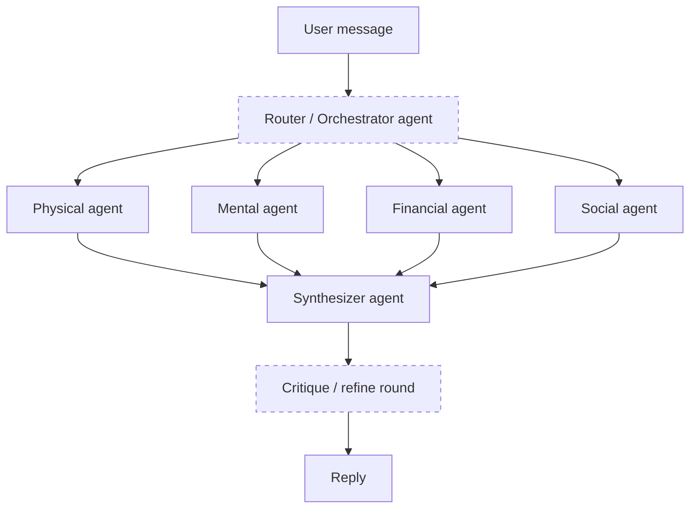
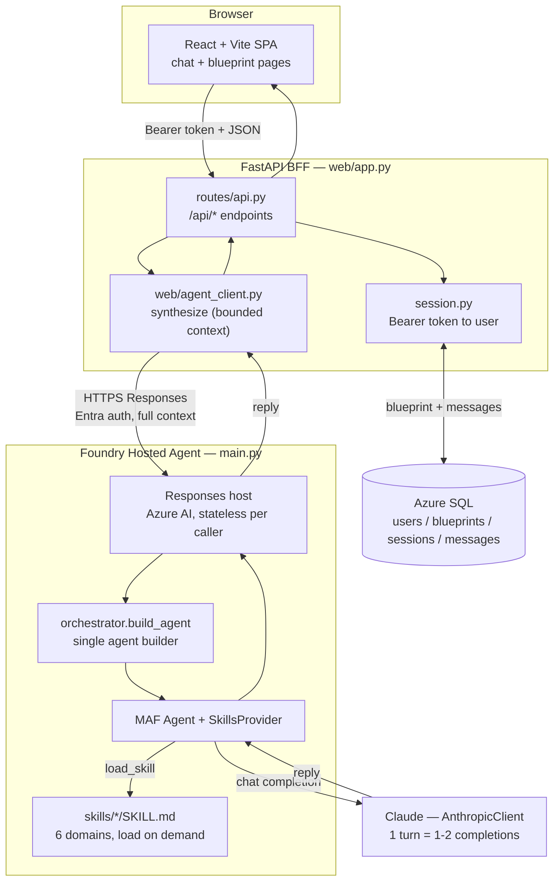
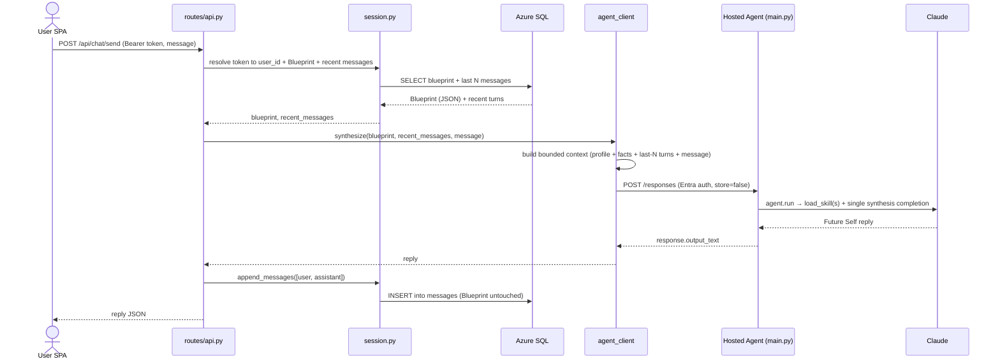
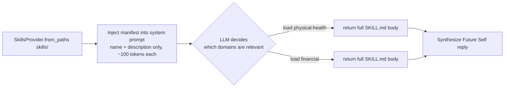
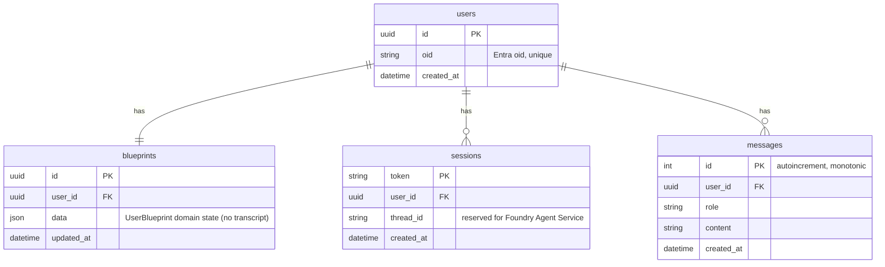
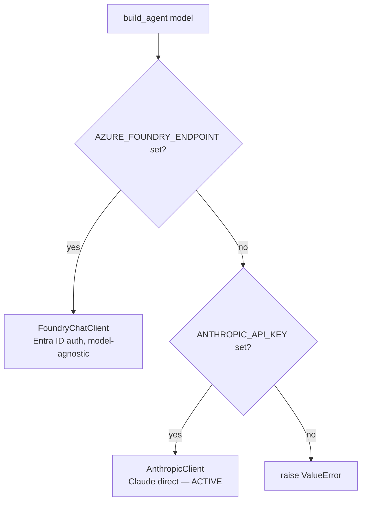
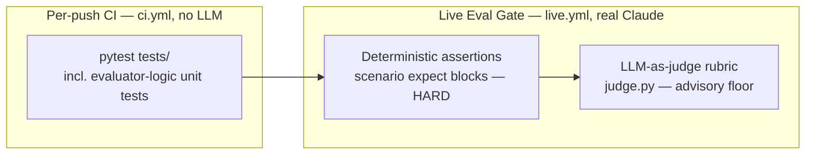

# FutureSelf — Architecture & Functionality Guide

> An explanatory, diagram-first overview of how FutureSelf is built and how a
> request flows through it. For **normative contracts, data schemas, and the
> rebuild checklist** see [`futureself-spec.md`](./futureself-spec.md); for
> **governance and coding rules** see [`AGENTS.md`](./AGENTS.md). This document
> is the friendly map; those two are the law.

---

## 1. What FutureSelf is

FutureSelf is a **single-agent longevity guidance system**. The user talks to
one persona — their "Future Self" — which reasons holistically across health
domains (physical, mental, financial, social, geopolitical, time) and gives
personalized, long-horizon advice.

The defining design choices:

- **One user-facing agent.** No sub-agent fan-out, no debate/critique rounds.
- **~1–2 LLM completions per turn** — skill-loading adds a tool round-trip; no
  multi-pass refinement.
- **Domain expertise lives in skills**, not in the agent prompt — loaded
  on demand via the Microsoft Agent Framework (MAF) `SkillsProvider`.
- **Blueprint writes go through a single controlled path** and are immutable
  (`model_copy`, never in place).

> New to the project / prepping to explain it? **§2 is the design-rationale and
> evolution story** (the journey from a multi-agent committee to a single agent
> with skills, and from in-process orchestration to a hosted agent).

---

## 2. Design decisions & the journey (the interview narrative)

This section is the **"why."** Two architectural pivots are the story worth
telling: *many specialized agents → one agent + skills*, and *in-process
orchestration → a hosted agent over HTTP*.

### 2.1 The core insight

The product is **holistic, long-horizon guidance in one coherent voice**. A
longevity question ("should I buy a motorcycle at 45?") is never purely physical
or purely financial — the value is the *synthesis across domains*, delivered as a
single "Future Self" persona. That insight drives every structural choice:
**keep the synthesis whole, keep the voice singular.**

### 2.2 Journey 1 — from a multi-agent committee to a single agent + skills

**The tempting first design** (the one most "agentic" frameworks nudge you
toward): a router/orchestrator that dispatches to specialist agents — one per
domain — then a synthesizer (optionally with a critique/debate round) merges
their outputs.


*Rejected design — shown for contrast.*

**Why it's tempting:** clean separation of concerns, per-domain specialization,
apparent parallelism.

**Why it's the wrong fit here:**
- **Persona fragmentation.** Six specialist voices must be re-merged into one
  "Future Self" — you spend a whole synthesis pass undoing the fragmentation you
  just created.
- **Synthesis *is* the product.** Multi-agent splits exactly the cross-domain
  reasoning that delivers the value; the interesting trade-offs live *between*
  domains, not inside them.
- **Cost & latency.** Router + N specialists + synthesizer (+ critique) = 5–10
  LLM calls per turn, each re-sent the user's profile — often an order of
  magnitude more tokens and seconds.
- **Context duplication.** Every specialist needs the full Blueprint; you either
  copy it everywhere (cost) or starve agents of context (quality).
- **Operational drag.** Routing logic, per-agent failure handling, multi-agent
  debugging, more prompts to drift out of sync.

**The chosen design:** **one agent**; domain depth comes from **on-demand skills**
(progressive disclosure). The model *itself* routes — it reads a lightweight
manifest (skill name + one-line description) and calls `load_skill` for the
relevant ones. Routing collapses from "a separate agent" into "a cheap tool call."

| Dimension | Multi-agent committee | Single agent + skills (chosen) |
|---|---|---|
| Persona coherence | Fragmented; needs re-merge | Native — one voice |
| LLM calls / turn | ~5–10 | ~1–2 (skills add one tool round-trip) |
| Cross-domain synthesis | Bolted on at the end | Inherent to the single pass |
| Context handling | Duplicated to each agent | Assembled once |
| Extensibility | New agent + wiring + prompt | Add one `SKILL.md` file |
| Debuggability | Trace across many agents | One trace, one prompt |
| Cost / latency | High | Low |
| Core trade-off | Specialization | Relies on a capable generalist model |

**Cons of the chosen design (and mitigations):**
- *Needs a strong generalist model* → use a frontier model (Opus 4.8) that
  reasons well across all six domains.
- *Skill-selection quality = model quality* → acceptable and **observable**
  (traces show which skills loaded); manifest descriptions are tuned to guide it.
- *No cross-domain parallelism* → fine: synthesis is inherently sequential, and
  we only pay for the domains actually loaded.
- *Context must hold profile + history + loaded skills* → progressive disclosure
  keeps it lean (names + descriptions until a skill is actually needed).

**The litmus test (good interview line):** *would a great human advisor convene a
committee, or read up on the relevant areas and give one integrated answer?* The
architecture mirrors the second — the real cognitive model of an expert generalist.

### 2.3 Journey 2 — from in-process orchestration to a hosted agent over HTTP

**v1:** the web backend (BFF) ran the agent **in-process** — one function call
per turn, with retry + model-fallback logic in the web tier.

**v2 (current):** the agent is deployed as a **Foundry Hosted Agent**; the BFF
calls it **over HTTP** and becomes a thin client + system-of-record.

**Why pivot:**
- **One agent definition, many channels.** The same hosted agent serves the web
  BFF today and (e.g.) WhatsApp tomorrow — no agent logic duplicated per channel.
- **Independent scaling.** The LLM/skills workload scales separately from the web
  tier (scale-to-zero when idle).
- **Single runtime, no drift.** Exactly one place builds and runs the agent.
- **Managed observability** via the platform's OpenTelemetry pipeline.

**Trade-offs (be honest about them):**
- **+** simpler BFF, single source of truth for the agent, channel reuse, managed scaling.
- **−** a network hop; **cold-start latency** (scale-to-zero adds seconds —
  measured ~30 s on the first call after idle; fix with `minReplicas: 1` at higher
  cost); the endpoint is **stateless per caller** (no per-user isolation yet), so
  the BFF must own conversation history and resend full context each turn; the
  in-process model-fallback was dropped (now relying on SDK/agent retries).
- **An honest reversal worth mentioning:** the original plan assumed Foundry would
  manage thread memory; the endpoint turned out stateless per caller, so
  **our own database stayed the system of record.** Adapting the design to platform
  reality — rather than forcing the plan — is itself a decision.
- **Foundry Memory re-evaluated (and deferred):** Foundry later shipped a
  user-scoped Agent Memory (Cosmos-backed). We looked and passed — it's `preview`,
  needs Foundry-hosted chat+embedding models (we're Anthropic-direct), attaches to
  prompt-agents not our hosted agent, and its default auto-extraction is the same
  drift we were removing. It's a documented GA-revisit, not a now (spec §11.1).

### 2.4 Two memory tiers (design consequence)
The split falls out of the above: **durable domain memory** is the Blueprint
(`bio`/`psych`/`context` + confirmed `inferred_facts`) in Azure SQL, written only
via validated paths; **short-term memory** is the `messages` transcript, a bounded
last-N window sent per turn. Nothing is auto-inferred from replies — a chat turn
appends to `messages` and never mutates the Blueprint. This is why fact *drift* is
structurally impossible now, and why per-turn cost is bounded.

### 2.5 Cross-cutting principles
- **Immutability** (`model_copy`, never in place) → predictable state, trivial to
  test, no action-at-a-distance bugs.
- **Never crash a turn** → malformed/empty output degrades to safe defaults; a
  hosted-agent failure returns a retryable **503**, never a raw 500.
- **Eval-as-reviewer** (solo project) → deterministic assertions + an LLM-as-judge
  stand in for a human PR reviewer (§11).
- **Observability-first** → distributed tracing in App Insights literally *proves*
  the "~1–2 completions per turn" claim (two `chat` spans with `load_skill`
  between them; BFF role `futureself-bff`, agent role `agentsv2`).
- **Fit-for-purpose auth** → Entra SSO was built and then deliberately *not*
  activated: open trials shouldn't require Azure AD accounts. Email/password
  (PBKDF2, same session-token mechanism, same authorization invariant) shipped
  instead; Entra stays flagged as the enterprise upgrade path.
- **Roles before agents** → the Curator (context freshness: fact-review prompts,
  retest protocols, blueprint gaps) is a *policy module*, not a second agent —
  deterministic rules surfaced as neutral UI copy. An LLM/A2A version is a
  documented upgrade path, taken only when rules demonstrably fall short.

---

## 3. High-level architecture



**One agent, called over HTTP.** The agent runs in exactly one place — the
Foundry Hosted Agent (`main.py`), built by the single `orchestrator.build_agent`.
The BFF no longer runs it in-process: `web/agent_client.py` sends a **bounded**
per-turn context to the agent's **stateless** Responses endpoint (Microsoft
Entra auth) and keeps Azure SQL as the system of record — the Blueprint (domain
state) and the append-only `messages` transcript. See
[`futureself-spec.md` §11](./futureself-spec.md).

---

## 4. The turn lifecycle

What happens on a single `POST /api/chat/send`:



Key invariants enforced here:

- **One agent, one synthesis pass per turn.** `load_skill` is a tool call, so the
  model resumes after the tool result: a turn that loads skills costs **~2
  completions** (one to request the skill(s), one to synthesize), one that loads
  none costs 1. Still a single agent — no fan-out, no critique rounds. (Verified
  in prod via App Insights: `chat` spans ≈ 2× `invoke_agent` spans.)
- **Bounded context.** Only the last N turns (`FUTURESELF_HISTORY_WINDOW`, default
  10) are sent, and the profile carries no transcript — per-turn tokens stay
  constant instead of growing with the conversation.
- **Domain state is validated-only.** A chat turn appends to `messages` and never
  writes the Blueprint. Blueprint fields change only via the `/blueprint/*` PATCH
  endpoints; nothing is auto-inferred from model output.
- **Graceful degradation.** An empty model reply yields an empty `reply` rather
  than crashing; a hosted-agent failure returns a retryable **503**, never a raw 500.
- **Stateless agent, durable Azure SQL.** The agent endpoint stores nothing per
  caller (`store=false`); the BFF owns the transcript in the `messages` table.

---

## 5. Skills: progressive domain disclosure

Domain knowledge is **not** baked into the system prompt. Each domain is a
folder with a `SKILL.md` (YAML frontmatter `name` + `description`, then the
domain reasoning body).



The six skills (each `src/futureself/skills/<name>/SKILL.md`):

| Skill | `name` (key) | Focus |
|-------|--------------|-------|
| Physical Health | `physical-health` | Nutrition, exercise, sleep, biomarkers, medical-risk-aware longevity |
| Mental Health | `mental-health` | Stress, emotional regulation, resilience, crisis signals |
| Financial | `financial` | Long-horizon planning, risk control, healthcare affordability |
| Social Relations | `social-relations` | Loneliness reduction, relationship quality, community |
| Geopolitics | `geopolitics` | Location risk (air quality, climate, stability, healthcare access) |
| Time Management | `time-management` | Turning strategy into executable habits and schedules |

> **MAF naming constraint:** a skill's frontmatter `name` must **match its
> directory name** and use only lowercase letters, numbers, and hyphens
> (no underscores). MAF silently skips any `SKILL.md` that violates this,
> which disables that domain.

---

## 6. Data model

### 6.1 Persistence (Azure SQL Database)



A session **Bearer token** maps to a user; each user has one `blueprints` row
(domain state as JSON) and an append-only `messages` transcript. "Last N turns"
is `WHERE user_id = ? ORDER BY id DESC LIMIT N`. Schema is managed by Alembic
(`alembic/versions/`); dialect-agnostic types run on Azure SQL in prod and SQLite
in tests.

### 6.2 Domain object (`UserBlueprint`, in `schemas.py`)

The Blueprint is a frozen Pydantic model — the user's **durable, validated**
domain profile (the transcript lives in the `messages` table, not here):

- **`bio`** — age, sex, height/weight, conditions, medications, supplements,
  biomarker history, exam records.
- **`psych`** — goals, fears, stress level, mental-health flags.
- **`context`** — location, occupation, income, family, lifestyle notes.
- **`inferred_facts`** — **confirmed-only** facts. Not auto-inferred from replies
  (that caused drift); empty until a validated writer exists.

Other contracts: `OrchestratorResult` (reply + updated Blueprint + traces) and
`LLMCallTrace` (per-turn task/model/latency). Full field-level detail is in
[`futureself-spec.md` §5](./futureself-spec.md).

---

## 7. Provider selection & deployment topology

The same agent builder supports two backends, chosen by environment variable:



- **Model provider (inside the agent):** Anthropic direct,
  `FUTURESELF_MODEL=claude-opus-4-8`. `FoundryChatClient` is the model-agnostic
  alternative (any Foundry-deployed model) — same builder, no code change.
- **Two deployables:**
  - **BFF** → Docker image → ACR → **Azure Container Apps** (`deploy.yml`,
    zero-downtime rolling update). Has a **system-assigned managed identity** with
    the Foundry *Azure AI User* role, which is how it authenticates to the agent.
    Trace role: `futureself-bff`.
  - **Hosted agent** → `Dockerfile.agent` → **Foundry Hosted Agent** (deployed via
    `azd`). **Scales to zero** when idle (cold start adds seconds on the first call
    after idle). Trace role: `agentsv2`.
- **Database:** **Azure SQL Database** (serverless free tier) — the BFF's `DATABASE_URL`.
  The BFF image bundles the Microsoft ODBC driver (`msodbcsql18`) for the async
  `mssql+aioodbc` driver; migrations run on startup (`alembic upgrade head`). The
  agent has no database.
- **Observability:** both processes emit OpenTelemetry → the same Application
  Insights (`futureself-insights`); one chat turn shows as two correlated
  transactions (BFF request + agent run). Enabled when
  `APPLICATIONINSIGHTS_CONNECTION_STRING` is set; `OTEL_SERVICE_NAME` sets the
  trace role name.

---

## 8. Repository map

| Path | Responsibility |
|------|----------------|
| `frontend/` | React + Vite + Tailwind SPA. `lib/api.ts` calls the BFF; chat + Blueprint pages. |
| `src/futureself/web/app.py` | FastAPI factory: CORS, router mount, OTel, serves built SPA. |
| `src/futureself/web/routes/api.py` | JSON REST endpoints (session, chat, blueprint, quality). |
| `src/futureself/web/session.py` | Sessions, accounts, `messages` transcript store, WhatsApp binding — backed by Azure SQL. |
| `src/futureself/web/passwords.py` | PBKDF2 password hashing (stdlib-only) for email/password auth. |
| `src/futureself/web/facts.py` | Fact distiller — LLM pass proposing candidates; user confirms (memory lifecycle). |
| `src/futureself/web/curator.py` | Curator v1 — rule-based context-quality nudges (no LLM, no second agent). |
| `src/futureself/web/whatsapp.py` + `routes/whatsapp.py` | WhatsApp channel: Twilio signature auth, link codes, async replies. |
| `src/futureself/orchestrator.py` | `build_agent` — the single agent builder (run by the hosted agent). |
| `src/futureself/web/agent_client.py` | BFF→hosted-agent client: `synthesize` + bounded `build_user_context`. |
| `src/futureself/schemas.py` | Pydantic data contracts (`UserBlueprint`, results, traces). |
| `src/futureself/skills/<name>/SKILL.md` | The six domain skills. |
| `src/futureself/blueprint_quality.py` | Rule-based Blueprint data-quality report (no LLM). |
| `src/futureself/eval.py` | Deterministic scenario assertions (`expect` blocks; no LLM). |
| `src/futureself/judge.py` | LLM-as-judge rubric scorer (offline quality gate). |
| `src/futureself/db/` | SQLAlchemy models + async engine. |
| `alembic/` | Database migrations. |
| `main.py` | Foundry Hosted-Agent Responses host — the single agent runtime. |
| `simulate.py` | CLI harness to run `scenarios/*.yaml` through the hosted agent. |
| `scenarios/` | Multi-turn test scenarios. |
| `prompts/orchestrator.md` | The Future Self system prompt. |
| `infra/azure/`, `.github/workflows/`, `Dockerfile` | Deployment & CI/CD. |
| `tests/` | Unit/integration tests (live tests gated by the `live` marker). |

---

## 9. REST API surface (BFF)

All under `/api`; everything except session/auth/webhook requires
`Authorization: Bearer <token>`.

| Method | Path | Purpose |
|--------|------|---------|
| `POST` | `/session/create` | Anonymous session (kept for tooling; the UI uses accounts). |
| `POST` | `/auth/register` \| `/auth/login` \| `/auth/logout` | Email/password accounts → session token. |
| `POST` | `/onboarding/complete` | Mark onboarding done (`UserBlueprint.onboarded`). |
| `POST` | `/account/reset` | Delete all data (Blueprint + transcript), keep login, re-onboard. |
| `POST` | `/chat/send` | Run one turn; return the Future Self reply. |
| `DELETE` | `/messages` | Clear conversation history only (Blueprint untouched). |
| `POST` | `/facts/candidates` \| `/facts/confirm` | Fact distillation: propose → user-confirmed save (+ optional prune). |
| `GET` | `/curator/nudges` | Curator v1: rule-based context-quality nudges. |
| `GET` | `/blueprint` | Read the current Blueprint. |
| `PATCH` | `/blueprint/bio` \| `/context` \| `/psych` | **Partial-merge** update of a Blueprint section. |
| `POST` | `/blueprint/biomarkers` | Add a measurement (dated data point per marker). |
| `PUT` | `/blueprint/biomarkers` | Replace the history — edit/delete any measurement. |
| `POST` | `/blueprint/supplements` | Add/replace a supplement (by name). |
| `DELETE` | `/blueprint/supplements/{name}` | Remove a supplement. |
| `GET` | `/blueprint/quality` | Rule-based data-quality report. |
| `POST` | `/whatsapp/link` \| `/whatsapp/unlink`, `GET /whatsapp/status` | WhatsApp channel binding (one-time code). |
| `POST` | `/whatsapp/webhook` | Twilio inbound (signature-authenticated; no Bearer). |

---

## 10. Running it locally

The agent and the BFF are two processes (spec §11). Copy `.env.example` → `.env`
first; it documents which vars belong to which process.

1. **Agent:** set `ANTHROPIC_API_KEY` + `FUTURESELF_MODEL`, then run the hosted
   agent locally: `python main.py` (Responses host on `:8088`).
2. **BFF:** point `FOUNDRY_AGENT_ENDPOINT` at the agent (local `:8088` or the
   deployed endpoint), set `DATABASE_URL` (Azure SQL; local dev can point at any
   SQLAlchemy-supported DB), and ensure Azure auth (`az login`) for the agent.
3. Install deps with `uv sync --prerelease=allow` (the Foundry hosting SDK is
   beta — see `AGENTS.md` → Hosting SDK).
4. Apply migrations (`alembic upgrade head`) against your Azure SQL database.
5. Backend: `uvicorn futureself.web.app:app --reload`.
6. Frontend: `cd frontend && bun install && bun run dev` (set `VITE_API_URL` to
   the backend origin).

**Fast paths that need no DB or browser:**

- Scenario harness: `python simulate.py --scenario <name>` (drives the hosted
  agent via `agent_client.synthesize`; needs `FOUNDRY_AGENT_ENDPOINT` + Azure auth).
- Tests: `pytest` (live LLM tests are excluded by default).

---

## 11. Evaluation (the reviewer for a solo project)

With no human PR reviewer, an automated **evaluator** is the quality gate before
changes land on `main`. It runs in two tiers:



- **Deterministic assertions** (`eval.py` + each scenario's `expect:` block):
  length bounds, required topical keywords (`must_include_any`), and `forbidden`
  phrases (e.g. tool-narration leaks). Objective and repeatable → **hard
  pass/fail**. The *logic* is unit-tested in `ci.yml` (no LLM, blocks every
  push); the *checks against real replies* run in the live tier.
- **LLM-as-judge** (`judge.py`): a Claude judge scores each reply 1–5 against
  `DEFAULT_RUBRIC` plus any scenario-specific `rubric:` criteria. Non-deterministic
  and costs tokens, so it's **advisory** — a score below `JUDGE_FLOOR` (default 3)
  fails to catch egregious regressions. It is offline eval tooling, *not* part of
  the runtime agent (the one-agent / one-completion rules govern the hosted agent only).

Run it locally before merging:

```bash
python simulate.py --scenario motorcycle_purchase --eval --judge
pytest tests/scenarios/ -m live -v            # all scenarios, both tiers
```

Or trigger the **Live Eval Gate** workflow on GitHub (`live.yml`,
`workflow_dispatch`; needs the `ANTHROPIC_API_KEY` secret).

## 12. Where to go deeper

- **Contracts, persistence boundaries, rebuild checklist:** [`futureself-spec.md`](./futureself-spec.md)
- **Governance, coding standards, do-not-do list:** [`AGENTS.md`](./AGENTS.md)
- **Agent behavior & tone:** [`prompts/orchestrator.md`](./prompts/orchestrator.md)
- **Domain reasoning:** `src/futureself/skills/<name>/SKILL.md`
```
