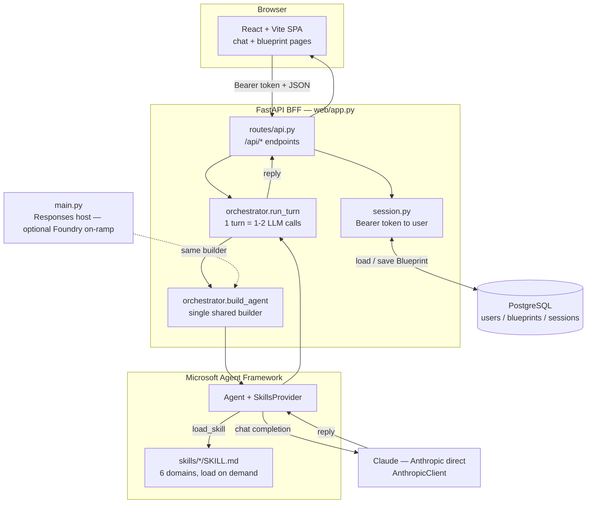
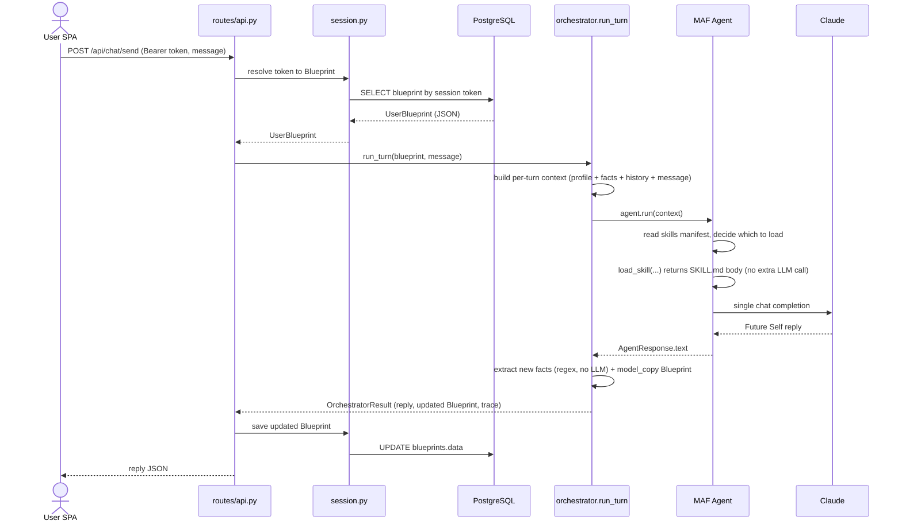
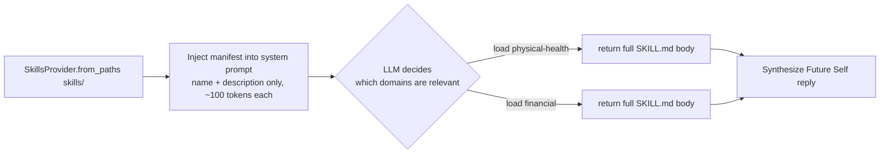
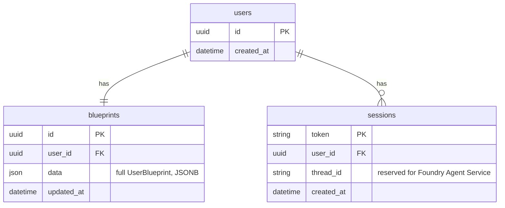
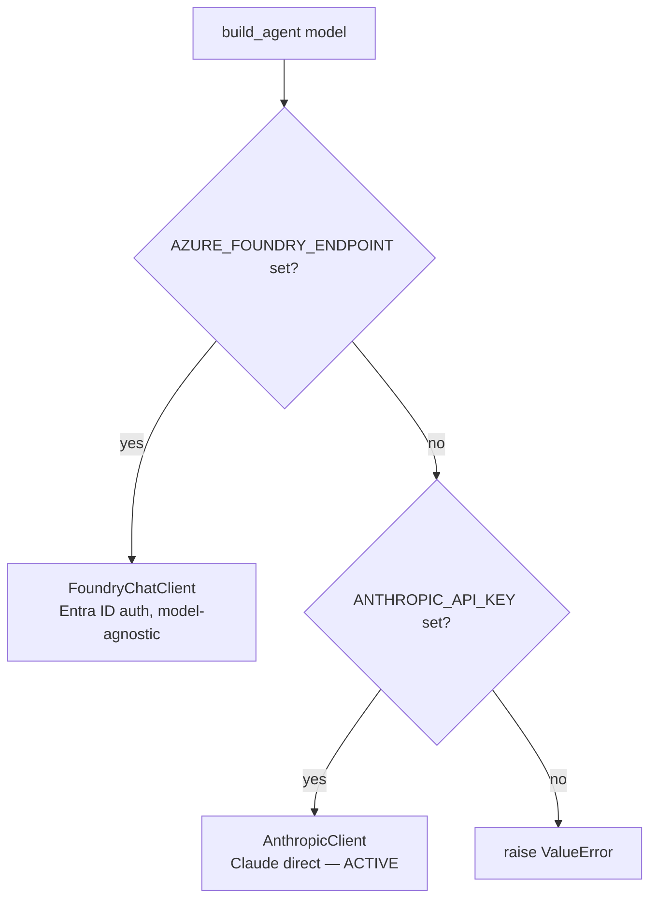
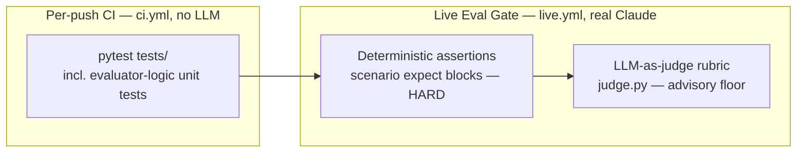

# FutureSelf — Architecture & Functionality Guide

> An explanatory, diagram-first overview of how FutureSelf is built and how a
> request flows through it. For **normative contracts, data schemas, and the
> rebuild checklist** see [`futureself-spec.md`](./futureself-spec.md); for
> **governance and coding rules** see [`AGENTS.md`](./AGENTS.md). This document
> is the friendly map; those two are the law.

---

## 1. What FutureSelf is

FutureSelf is a **single-agent longevity guidance system**. The user talks to
one persona — their "Future Self" — which reasons holistically across health
domains (physical, mental, financial, social, geopolitical, time) and gives
personalized, long-horizon advice.

The defining design choices:

- **One user-facing agent.** No sub-agent fan-out, no debate/critique rounds.
- **One LLM completion per turn** (plus zero-cost tool calls to load skills).
- **Domain expertise lives in skills**, not in the orchestrator prompt — loaded
  on demand via the Microsoft Agent Framework (MAF) `SkillsProvider`.
- **The orchestrator is the only writer of the user's Blueprint**, and it
  mutates it immutably (`model_copy`, never in place).

---

## 2. High-level architecture



**Two entry points, one agent.** The browser-facing path (BFF → `run_turn`) is
canonical for the active **Anthropic-direct** deployment. `main.py` is an
optional Azure AI Foundry Hosted-Agent on-ramp. Both build the *identical*
agent through `orchestrator.build_agent`, so they cannot drift. The BFF only
proxies the Foundry host once Foundry Agent Service manages thread memory — see
[`futureself-spec.md` §11](./futureself-spec.md).

---

## 3. The turn lifecycle

What happens on a single `POST /api/chat/send`:



Key invariants enforced here:

- **One agent, one synthesis pass per turn.** `load_skill` is a tool call, so the
  model resumes after the tool result: a turn that loads skills costs **~2
  completions** (one to request the skill(s), one to synthesize), one that loads
  none costs 1. Still a single agent — no fan-out, no critique rounds. (Verified
  in prod via App Insights: `chat` spans ≈ 2× `invoke_agent` spans.)
- **Immutability.** `run_turn` returns a *new* Blueprint via `model_copy`; it
  never mutates the input.
- **Graceful degradation.** A malformed/empty model reply yields an empty
  `user_facing_reply` rather than crashing the turn.

---

## 4. Skills: progressive domain disclosure

Domain knowledge is **not** baked into the system prompt. Each domain is a
folder with a `SKILL.md` (YAML frontmatter `name` + `description`, then the
domain reasoning body).



The six skills (each `src/futureself/skills/<name>/SKILL.md`):

| Skill | `name` (key) | Focus |
|-------|--------------|-------|
| Physical Health | `physical-health` | Nutrition, exercise, sleep, biomarkers, medical-risk-aware longevity |
| Mental Health | `mental-health` | Stress, emotional regulation, resilience, crisis signals |
| Financial | `financial` | Long-horizon planning, risk control, healthcare affordability |
| Social Relations | `social-relations` | Loneliness reduction, relationship quality, community |
| Geopolitics | `geopolitics` | Location risk (air quality, climate, stability, healthcare access) |
| Time Management | `time-management` | Turning strategy into executable habits and schedules |

> **MAF naming constraint:** a skill's frontmatter `name` must **match its
> directory name** and use only lowercase letters, numbers, and hyphens
> (no underscores). MAF silently skips any `SKILL.md` that violates this,
> which disables that domain.

---

## 5. Data model

### 5.1 Persistence (PostgreSQL)



A session **Bearer token** maps to a user; each user has one `blueprints` row
whose `data` column stores the entire `UserBlueprint` serialized as JSON(B).
Schema is managed by Alembic (`alembic/versions/`).

### 5.2 Domain object (`UserBlueprint`, in `schemas.py`)

The Blueprint is a frozen Pydantic model — the user's evolving profile:

- **`bio`** — age, sex, height/weight, conditions, medications, supplements,
  biomarker history, exam records.
- **`psych`** — goals, fears, stress level, mental-health flags.
- **`context`** — location, occupation, income, family, lifestyle notes.
- **`conversation_history`** — list of `{role, content}` turns.
- **`inferred_facts`** — facts extracted from replies (regex, no LLM).

Other contracts: `OrchestratorResult` (reply + updated Blueprint + traces) and
`LLMCallTrace` (per-turn task/model/latency). Full field-level detail is in
[`futureself-spec.md` §5](./futureself-spec.md).

---

## 6. Provider selection & deployment topology

The same agent builder supports two backends, chosen by environment variable:



- **Active deployment:** Anthropic direct, `FUTURESELF_MODEL=claude-opus-4-8`.
- **Optional:** Azure AI Foundry (any Foundry-deployed model) via the
  Responses host in `main.py`.
- **Cloud target (per CI):** container pushed to ACR and deployed to Azure
  Container Apps; infra in `infra/azure/main.bicep`. Observability is MAF's
  built-in OpenTelemetry → Application Insights (enabled only when
  `APPLICATIONINSIGHTS_CONNECTION_STRING` is set).

---

## 7. Repository map

| Path | Responsibility |
|------|----------------|
| `frontend/` | React + Vite + Tailwind SPA. `lib/api.ts` calls the BFF; chat + Blueprint pages. |
| `src/futureself/web/app.py` | FastAPI factory: CORS, router mount, OTel, serves built SPA. |
| `src/futureself/web/routes/api.py` | JSON REST endpoints (session, chat, blueprint, quality). |
| `src/futureself/web/session.py` | Bearer-token sessions backed by Postgres. |
| `src/futureself/orchestrator.py` | `run_turn`, `build_agent`, context build, fact extraction. |
| `src/futureself/schemas.py` | Pydantic data contracts (`UserBlueprint`, results, traces). |
| `src/futureself/skills/<name>/SKILL.md` | The six domain skills. |
| `src/futureself/blueprint_quality.py` | Rule-based Blueprint data-quality report (no LLM). |
| `src/futureself/eval.py` | Deterministic scenario assertions (`expect` blocks; no LLM). |
| `src/futureself/judge.py` | LLM-as-judge rubric scorer (offline quality gate). |
| `src/futureself/db/` | SQLAlchemy models + async engine. |
| `alembic/` | Database migrations. |
| `main.py` | Foundry Hosted-Agent Responses host (optional on-ramp). |
| `simulate.py` | CLI harness to run `scenarios/*.yaml` through `run_turn`. |
| `scenarios/` | Multi-turn test scenarios. |
| `prompts/orchestrator.md` | The Future Self system prompt. |
| `infra/azure/`, `.github/workflows/`, `Dockerfile` | Deployment & CI/CD. |
| `tests/` | Unit/integration tests (live tests gated by the `live` marker). |

---

## 8. REST API surface (BFF)

All under `/api`; chat and blueprint routes require `Authorization: Bearer <token>`.

| Method | Path | Purpose |
|--------|------|---------|
| `POST` | `/session/create` | Create a blank session, return a session token. |
| `POST` | `/chat/send` | Run one turn; return the Future Self reply. |
| `GET` | `/blueprint` | Read the current Blueprint. |
| `PATCH` | `/blueprint/bio` \| `/context` \| `/psych` | Update a Blueprint section. |
| `POST` | `/blueprint/biomarkers` | Append a biomarker entry. |
| `POST` | `/blueprint/supplements` | Add/replace a supplement (by name). |
| `DELETE` | `/blueprint/supplements/{name}` | Remove a supplement. |
| `GET` | `/blueprint/quality` | Rule-based data-quality report. |

---

## 9. Running it locally

1. Copy `.env.example` → `.env` and set `ANTHROPIC_API_KEY`, `FUTURESELF_MODEL`,
   and `DATABASE_URL` (Postgres). See `.env.example` for the full list.
2. Install deps with `uv sync --prerelease=allow` (the Foundry hosting SDK is
   beta — see `AGENTS.md` → Hosting SDK).
3. Apply migrations (`alembic upgrade head`) against your Postgres.
4. Backend: `uvicorn futureself.web.app:app --reload`.
5. Frontend: `cd frontend && bun install && bun run dev` (set `VITE_API_URL` to
   the backend origin).

**Fast paths that need no DB or browser:**

- One turn end-to-end: drive `orchestrator.run_turn` directly.
- Scenario harness: `python simulate.py --scenario <name>` (see `scenarios/`).
- Tests: `pytest` (live LLM tests are excluded by default).

---

## 10. Evaluation (the reviewer for a solo project)

With no human PR reviewer, an automated **evaluator** is the quality gate before
changes land on `main`. It runs in two tiers:



- **Deterministic assertions** (`eval.py` + each scenario's `expect:` block):
  length bounds, required topical keywords (`must_include_any`), and `forbidden`
  phrases (e.g. tool-narration leaks). Objective and repeatable → **hard
  pass/fail**. The *logic* is unit-tested in `ci.yml` (no LLM, blocks every
  push); the *checks against real replies* run in the live tier.
- **LLM-as-judge** (`judge.py`): a Claude judge scores each reply 1–5 against
  `DEFAULT_RUBRIC` plus any scenario-specific `rubric:` criteria. Non-deterministic
  and costs tokens, so it's **advisory** — a score below `JUDGE_FLOOR` (default 3)
  fails to catch egregious regressions. It is offline eval tooling, *not* part of
  the runtime agent (the one-agent / one-completion rules govern `run_turn` only).

Run it locally before merging:

```bash
python simulate.py --scenario motorcycle_purchase --eval --judge
pytest tests/scenarios/ -m live -v            # all scenarios, both tiers
```

Or trigger the **Live Eval Gate** workflow on GitHub (`live.yml`,
`workflow_dispatch`; needs the `ANTHROPIC_API_KEY` secret).

## 11. Where to go deeper

- **Contracts, persistence boundaries, rebuild checklist:** [`futureself-spec.md`](./futureself-spec.md)
- **Governance, coding standards, do-not-do list:** [`AGENTS.md`](./AGENTS.md)
- **Agent behavior & tone:** [`prompts/orchestrator.md`](./prompts/orchestrator.md)
- **Domain reasoning:** `src/futureself/skills/<name>/SKILL.md`
```
