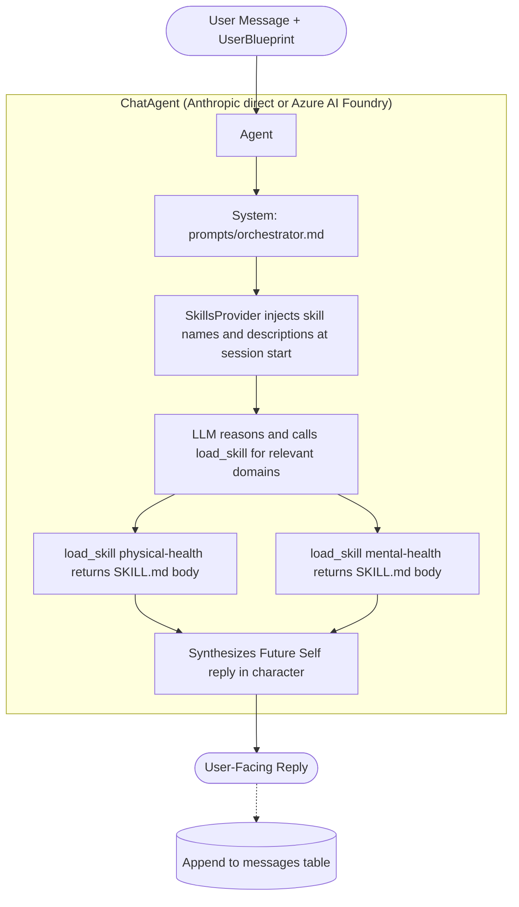

# FutureSelf Functional Specification

> Status: Active Implementation Spec
> Date: 2026-04-13
> Scope: Architecture and contracts after single-agent refactoring (Phases 1–5 complete)

---

## 1. Overview

**FutureSelf is a single-agent longevity guidance system.**
**The only user-facing component is the Future Self Synthesizer.**
Domain expertise is delivered via six skills loaded on demand — not via parallel sub-agents.

### Core goals
- **Holistic:** Health is not just physical; it's mental, financial, social, and environmental.
- **Personalized:** Advice adapts to the user's specific biology, location, and lifestyle.
- **Long-term:** The interaction model is designed for a lifelong relationship, not transactional queries.
- **Persona-consistent synthesis** as the user's future self.
- **Controlled blueprint updates** owned by orchestrator only.
- **Minimal LLM calls:** one synthesis pass per turn. Skill loading is a tool call, so the model resumes after the tool result — a turn that loads skills uses ~2 completions (one to request the skill(s), one to synthesize); a turn that loads none uses 1. No multi-agent fan-out or critique rounds.

---

## 2. Architecture Overview

Single-agent pipeline with MAF SkillsProvider for progressive domain disclosure.



**LLM calls per turn:** the model emits its `load_skill` tool calls in one completion (N = 0–3 domains, typically a single tool-call round), then synthesizes the reply in a second — so **~2 completions when skills load, 1 when none do**. Each tool-call round the model resumes from is an additional completion; the SkillsProvider *returning* a SKILL.md body is in-process and free, but the model consuming it is not. (Confirmed in production via App Insights: `chat` spans ≈ 2× `invoke_agent` spans.)

---

## 3. Skills

| # | Skill | Key | File |
|---|-------|-----|------|
| 1 | Physical Health | `physical-health` | `src/futureself/skills/physical-health/SKILL.md` |
| 2 | Mental Health | `mental-health` | `src/futureself/skills/mental-health/SKILL.md` |
| 3 | Financial | `financial` | `src/futureself/skills/financial/SKILL.md` |
| 4 | Social Relations | `social-relations` | `src/futureself/skills/social-relations/SKILL.md` |
| 5 | Geopolitics | `geopolitics` | `src/futureself/skills/geopolitics/SKILL.md` |
| 6 | Time Management | `time-management` | `src/futureself/skills/time-management/SKILL.md` |

> **Skill naming (MAF constraint):** each skill's frontmatter `name` must match its
> directory name and use only lowercase letters, numbers, and hyphens (no underscores;
> ≤64 chars). MAF's `SkillsProvider` silently skips any `SKILL.md` whose `name` is
> invalid or mismatched, which disables that domain. Keep directory name == frontmatter `name`.

### Domain Intent Snapshot

- **Physical Health:** Nutrition, exercise, sleep, biomarkers, and medical-risk-aware longevity advice.
- **Mental Health:** Stress resilience, emotional regulation, crisis signal awareness, and behavioral durability.
- **Financial:** Long-horizon planning, risk control, healthcare affordability, and stress-reducing simplicity.
- **Social Relations:** Loneliness risk reduction, relationship quality, and durable community integration.
- **Geopolitics:** Location risk analysis (air quality, climate, stability, healthcare system access).
- **Time Management:** Translating strategy into executable habits and schedules under real-life constraints.

---

## 4. Runtime Orchestration Flow

The turn is split across two processes (spec §11): the **BFF** assembles context
and persists state; the **hosted agent** runs the LLM + skills. The BFF side
lives in `web/agent_client.py`:

1. **Build** the context block from `UserBlueprint` + `user_message` (profile,
   inferred facts, last 10 conversation turns) — `build_user_context`.
2. **Synthesize** — `synthesize` POSTs the context to the hosted agent's
   stateless Responses endpoint (`store=False`). Inside the agent (built by the
   shared `build_agent`):
   - SkillsProvider injects skill names + descriptions at session start.
   - LLM reads the turn context, decides which skills are relevant, calls `load_skill` for each.
   - SkillsProvider returns the full SKILL.md body (in-process, no LLM call) — but the model must resume to use it.
   - LLM synthesizes the Future Self reply in character (a second completion when skills were loaded).
3. **Append** the user message and the reply to the `messages` store via
   `session.append_messages`. **No fact extraction and no Blueprint write** — a
   chat turn only extends the transcript (facts are validated-only, §11.1).

Notes:
- Fact extraction is synchronous and regex-based — no additional LLM cost.
- Unit tests mock `synthesize` (no Azure credentials needed); the helpers are
  pure and tested directly.

---

## 5. Data Contracts

All contracts live in `src/futureself/schemas.py`.

### 5.1 User Blueprint (`UserBlueprint`)

Frozen Pydantic model (`frozen=True`). Immutable for all callers; the orchestrator returns an updated copy via `model_copy`.

Top-level fields (**domain state only** — the conversation transcript is a
separate `messages` table, §11.1, not on the Blueprint):
- `bio: BioData`
- `psych: PsychData`
- `context: ContextData`
- `inferred_facts: list[str]` — **confirmed-only.** Not auto-inferred from model
  output (that caused drift); populated solely via validated paths — today that is
  the user-confirmed fact distillation (§11.1).
- `onboarded: bool` — set by the onboarding wizard; reset by "delete all data".

Class method:
- `from_dict(data: dict) -> UserBlueprint` — used by scenario test loader.

#### `BioData`

- `age: int | None`
- `sex: str | None`
- `height_cm: float | None`
- `weight_kg: float | None`
- `conditions: list[str]`
- `medications: list[str]`
- `supplements: list[Supplement]`
- `biomarker_history: list[BiomarkerEntry]`
- `exam_records: list[ExamRecord]`

Supporting types:
- **`Supplement`:** `name`, `dose`, `started`, `stopped`, `reason`
- **`BiomarkerEntry`:** `marker`, `value`, `unit`, `date`, `source`
- **`ExamRecord`:** `exam_type`, `date`, `provider`, `key_findings`, `raw_text`

#### `PsychData`

- `goals: list[str]`
- `fears: list[str]`
- `stress_level: str | None`
- `mental_health_flags: list[str]`

#### `ContextData`

- `location_city: str | None`
- `location_country: str | None`
- `occupation: str | None`
- `income_usd_annual: float | None`
- `family_situation: str | None`
- `lifestyle_notes: list[str]`

#### `ConversationTurn`

- `role: Literal["user", "assistant"]`
- `content: str`

### 5.2 LLM Call Trace (`LLMCallTrace`)

- `task: str` — e.g. `"orchestrator.run_turn"`
- `model_requested: str`
- `model_actual: str | None` — populated if provider reports actual model used
- `prompt_tokens: int`
- `completion_tokens: int`
- `latency_ms: float`

### 5.3 Turn Result (`OrchestratorResult`)

- `user_facing_reply: str`
- `updated_blueprint: UserBlueprint`
- `llm_traces: list[LLMCallTrace]`

---

## 6. MAF Skills and Agent Client

### SkillsProvider (Microsoft Agent Framework)

`SkillsProvider.from_paths(Path("src/futureself/skills"))` discovers all `SKILL.md` files and:
1. Injects a `load_skill` tool definition into the agent's tool list.
2. At session start, appends a short skills manifest to the system prompt (~100 tokens/skill): name + description only.
3. Handles `load_skill("<name>")` tool calls by returning the full SKILL.md body.

LLM reads the manifest and autonomously decides which skills to load based on the user message.

### Agent construction (`src/futureself/orchestrator.py`)

Two client backends, selected by environment variable:

**Anthropic direct** (`ANTHROPIC_API_KEY` set, no `AZURE_FOUNDRY_ENDPOINT`):
```python
from agent_framework import Agent, SkillsProvider
from agent_framework_anthropic import AnthropicClient

client = AnthropicClient(api_key=api_key, model=model)
agent = Agent(client, instructions=prompt, name="FutureSelf", context_providers=[skills_provider])
```

**Azure AI Foundry** (`AZURE_FOUNDRY_ENDPOINT` set) — model-agnostic (GPT, Claude, Grok, etc.):
```python
from agent_framework import Agent, SkillsProvider
from agent_framework_foundry import FoundryChatClient
from azure.identity import DefaultAzureCredential

client = FoundryChatClient(project_endpoint=endpoint, model=model, credential=DefaultAzureCredential())
agent = Agent(client, instructions=prompt, name="FutureSelf", context_providers=[skills_provider])
```

Session and run (inside the hosted agent's response handler, `main.py`):
```python
session = agent.create_session()           # sync — not async
result = await agent.run(user_ctx, session=session)
reply = result.text or ""                  # AgentResponse.text, not .value
```

`FUTURESELF_MODEL` env var controls the model name in both cases (required, no default).

### Observability

MAF's built-in OpenTelemetry instrumentation is activated at startup via:
```python
from azure.monitor.opentelemetry import configure_azure_monitor
configure_azure_monitor(connection_string=os.getenv("APPLICATIONINSIGHTS_CONNECTION_STRING"))
```
Set `APPLICATIONINSIGHTS_CONNECTION_STRING` as a Container App env var. Traces appear in Azure Portal → Application Insights → Transaction search. No custom span code needed.

---

## 7. Skill File Conventions

Each skill lives at `src/futureself/skills/<domain>/SKILL.md`. The frontmatter `name`
must equal `<domain>` (the directory name) and contain only lowercase letters, numbers,
and hyphens:

```markdown
---
name: physical-health
description: >
  Analyze physical health, fitness, biomarkers, medications, and longevity protocols.
  Use when the user asks about exercise, sleep, nutrition, supplements, lab results,
  aging biomarkers, or any body-related longevity topic.
---

# Physical Health — "The Biological Guardian"
...domain system prompt content...
```

Skill prompt body structure: **Role → Domain Expertise → Prioritization Framework → Guidelines → Output Format**

`prompts/orchestrator.md` is not a skill — it is the agent's system prompt and is NOT processed by `SkillsProvider`.

---

## 8. Reliability and Fallback Rules

**No single malformed LLM response — or transient provider error — may crash a turn.**

| Failure | Handling |
|---------|----------|
| Empty agent reply | `synthesize` returns `""`; the turn still persists |
| Fact extraction error | Return original blueprint unchanged |
| Hosted agent error (transient overload/timeout, or endpoint unreachable) | The OpenAI client retries (its built-in backoff); if it still fails, `chat_send` returns a retryable **503** (never a raw 500). The Anthropic SDK *inside* the hosted agent also retries the underlying model call. There is no longer a BFF-side model-fallback/`degraded` path — the cutover simplified it away. |
| No LLM provider configured (agent container) | `build_agent` raises at call time, not at import |
| `FOUNDRY_AGENT_ENDPOINT` unset (BFF) | `synthesize` raises → `chat_send` returns 503 |

`agent_framework` imports are lazy (inside `build_agent`); the cloud SDKs the BFF
needs (`openai`, `azure-identity`) are imported lazily inside `agent_client._client`,
so unrelated code paths load without them.

### Operational hardening (deployed)

- **Rate limiting** — per-IP fixed-window on `/api/*` (`RATE_LIMIT_PER_MIN`, default 30); in-memory/per-replica first layer (front with Front Door/APIM for global limits).
- **Input validation** — chat message capped 1–8000 chars (422 before any LLM call).
- **Security headers** — `nosniff`, `X-Frame-Options: DENY`, `Referrer-Policy`, HSTS on every response.
- **Secrets** — `ANTHROPIC_API_KEY` / `DATABASE_URL` / App Insights connection string stored as Container App *secrets*, referenced via `secretref:` (not plaintext env).
- **Migrations** — `alembic upgrade head` runs on startup (FastAPI lifespan, gated on `DATABASE_URL`).
- **CI/CD** — deploy gated on green CI (`workflow_run`); zero-downtime rolling update (`az containerapp update --image`), stable URL.

---

## 9. Testing Requirements

### 9.1 Unit/Integration (mocked hosted agent)

Must cover (`tests/web/test_agent_client.py`, `tests/web/test_routes.py`):
- `chat_send` returns `{"reply": ...}` and persists the turn (history + facts).
- Hosted agent error → BFF returns 503 (never a raw 500).
- A chat turn appends to `messages` and does **not** write the Blueprint; `inferred_facts` stays empty (no auto-inference).
- Conversation history appended with correct `ConversationTurn` objects.
- `session.append_messages` / `get_recent_messages`: append + windowed last-N ordering, per-user isolation.
- `build_user_context`: includes user message, facts, and history.
- `synthesize`: calls the Responses endpoint with `store=False`, handles empty
  `output_text` gracefully.

Mock pattern — the hosted agent is the only mocked component:
```python
# Route test: patch the BFF's synthesize with an AsyncMock returning the reply.
@patch("futureself.web.routes.api.synthesize", new_callable=AsyncMock)
async def test_chat_send_returns_reply(mock_synthesize, client):
    mock_synthesize.return_value = "Hello from the future."
    ...

# Client test: stub the cached OpenAI client.
fake = SimpleNamespace(responses=SimpleNamespace(create=AsyncMock(
    return_value=SimpleNamespace(output_text="..."))))
monkeypatch.setattr(agent_client, "_client", lambda: fake)
```

### 9.2 Live Scenario Tests (evaluator-as-reviewer)

- Marker-gated (`live`) and excluded by default (`addopts = "-m 'not live'"`).
- Scenario files in `scenarios/*.yaml`. Each defines `name`, `user_blueprint`,
  `turns` (with `user_message` and an optional `expect` block), and an optional
  scenario-level `rubric` (extra judge criteria).
- Multi-turn scenarios thread a local recent-turns list between turns (the BFF uses the `messages` table).
- **Two evaluation tiers (run against real Claude):**
  - *Deterministic assertions* (`eval.check_expectations` vs the `expect` block):
    length bounds, `must_include_any` topical keywords, `forbidden` phrases
    (e.g. tool-narration leaks). Objective → **hard** pass/fail.
  - *LLM-as-judge* (`futureself.judge`): rubric scoring 1–5; **advisory**, fails
    only below `JUDGE_FLOOR` (default 3). Offline eval tooling — not the runtime
    agent, so the one-agent / one-completion rules do not apply to it.
- The assertion *logic* is unit-tested in the default (non-live) tier, so CI
  guards the evaluator on every push. The live gate runs via `live.yml`
  (`workflow_dispatch`) or `simulate.py --eval --judge`.

---

## 10. Implementation Roadmap

> **Decision Rule:** Build the intelligence before the interface.

**Phase 1: Agent Laboratory** — *Complete*

**Phase 2: The Orchestrator** — *Complete*

**Phase 3: The Initial Interface** — *Complete*

**Phase 4: Model Router and Cloud** — *Complete*

**Phase 5: Observability** — *Complete*

**Architecture Refactoring** — *Complete*
- Replaced 6-stage supervisor-worker pipeline (7–11 LLM calls/turn) with a single reasoning LLM model.
- MAF `SkillsProvider` delivers progressive domain disclosure via `SKILL.md` files.
- `OrchestratorResult` simplified: removed `agents_consulted`, `initial_responses`, `refined_responses`, `conflict_detected`, `conflict_summary`, `AgentResponse`, `CritiqueContext`.
- Observability: MAF built-in OTel → Application Insights via `azure-monitor-opentelemetry` (configured at startup, no custom span code).
- Deployment: Azure Container Apps (Southeast Asia), FastAPI on port 8000, Docker image on `futureselfacr.azurecr.io`.
- LLM calls: 7–11 → ~1–2 per turn (one synthesis pass; +1 completion when skills load via tool call).

**Phase 6: The Data** — *Complete*
- User persistence (Azure SQL; Blueprint per user, transcript in `messages`). ✓
- Supplement tracking and biomarker measurement history (dated data points per
  marker; add/edit/delete via partial-merge PATCH + `PUT /blueprint/biomarkers`). ✓
- Blueprint data quality verification (`blueprint_quality`) and freshness
  flagging (Curator retest protocols, §11.36). ✓
- Conversation history population + memory lifecycle (distill→confirm→prune, §11.1). ✓

**Phase 6.5: Identity & Onboarding** — *Complete (email/password); Entra SSO built + flagged OFF as an optional upgrade*

Prerequisite slice for productionizing Phase 6: every Blueprint row must be owned by an authenticated user, and no user may read or mutate another user's data.

**Shipped (2026-07-03) — email/password identity + onboarding:**

- **Design decision:** the goal became "let many people *try* the app," and
  Entra sign-in would force every tester to have an Azure AD account. Shipped
  instead: lightweight **email/password** auth — `POST /auth/register|login|logout`
  issuing the same Bearer session tokens the app already used, PBKDF2-SHA256
  hashing (`web/passwords.py`, stdlib-only), `users.email`+`password_hash`
  (migration `0006`, filtered-unique like `oid`). The **authorization invariant
  is unchanged**: `user_id` is always resolved server-side from the session
  token, never from request input.
- **Onboarding wizard:** `/login` (sign-in/register) and `/onboarding` (2-step
  minimum-viable Blueprint: age/sex/country/occupation, goals/stress) — gated on
  `UserBlueprint.onboarded`; "delete all data & restart" (`POST /account/reset`)
  wipes Blueprint + transcript, keeps the login, and re-runs onboarding.
- **Session affordance:** settings menu shows logout; sessions are server-side
  rows (revocable via `/auth/logout`).

**Entra ID path — built, feature-flagged OFF (the original plan below):**

**Implementation status & sequencing (2026-06-24):**

- **Backend — done, deployed, feature-flagged OFF.** `web/auth.py` validates Entra
  JWTs (RS256 vs tenant JWKS; `iss`/`aud`/`exp`). `users.oid` (migration `0003`)
  maps the immutable `oid` → internal `user_id`, created with a blank Blueprint on
  first login; every Blueprint read/write goes through that server-resolved
  `user_id` (the authorization invariant). Active **only** when `ENTRA_TENANT_ID` +
  `ENTRA_CLIENT_ID` are set; otherwise the BFF stays in anonymous session-token
  mode (production default today, so the app is unchanged). Tests: JWT validity
  matrix + cross-user denial in `tests/web/test_auth.py`.
- **Frontend (MSAL.js) + activation — deferred into §11 (Foundry migration).** The
  React MSAL wiring, SPA redirect-URI registration, and flipping `ENTRA_*` on are
  done as part of the Foundry Hosted Agents step, so auth is activated **once**
  against the final topology and lands together with per-user Foundry thread
  binding (§11.1). The `oid → user_id` resolution above is the prerequisite for
  that binding — not throwaway work.
- **Rejected: Azure Container Apps built-in auth (EasyAuth).** It is coupled to the
  Container Apps platform, which the Foundry move partly supersedes; the portable
  MSAL.js + backend-JWT design survives the topology change and keeps identity
  token-based across the BFF → Foundry boundary.

- **Identity provider:** Microsoft Entra ID (workforce tenant initially; multi-tenant External ID configuration deferred to Phase 7 if WhatsApp B2C onboarding requires it).
- **Auth flow:** OIDC Authorization Code + PKCE from the React UI via MSAL.js. Backend validates Entra-issued JWTs (`iss`, `aud`, signature against tenant JWKS) on every protected request.
- **User identifier:** the Entra `oid` claim (immutable, tenant-scoped) is the canonical user key. A `users` table in Azure SQL maps `oid → internal user_id (UUID)`; everything else (Blueprint, messages, sessions) FKs to `user_id`.
- **Onboarding:** first-login flow detects no Blueprint exists for the `oid`, walks the user through a minimum viable Blueprint capture (age, sex, location, top goals, top fears), persists, and routes to the chat surface.
- **Authorization invariant (non-negotiable):** every database query that touches user data is filtered by the `user_id` derived from the validated token — never from a request body, query parameter, or client-supplied header. The orchestrator receives the resolved `user_id` from the auth middleware; it cannot be overridden by the caller.
- **Foundry thread binding:** when Phase 11 (Hosted Agents) lands, the per-user Foundry thread ID stored on the `users` row inherits the same authorization rule.
- **Tests:** add a cross-tenant access denial test (User A's token must not return User B's Blueprint) to the unit tier.

UI deliverables (React frontend):
- **Login screen** — unauthenticated landing surface with a single "Sign in with Microsoft" CTA wired to MSAL.js. No anonymous chat access.
- **Auth-guarded routes** — chat and blueprint pages redirect to the login screen when no valid session/token is present. `api.ts` attaches the MSAL access token as `Authorization: Bearer <jwt>` on every request; 401 responses trigger a silent token refresh, then a forced re-login if refresh fails.
- **Onboarding wizard** — first-login flow when the backend reports no Blueprint exists for the user's `oid`. Multi-step form capturing the minimum viable Blueprint (age, sex, location, top goals, top fears), persisted via the same `/api/blueprint` contract used by the existing settings UI. Wizard cannot be skipped; on completion the user is routed to chat.
- **Session affordance** — header shows the signed-in user (display name from the Entra `name` claim) and a sign-out action that clears the MSAL cache and returns to the login screen.
- **Multi-channel hint** — when the WhatsApp channel exists (Phase 7), the settings page shows the user's bound channel(s); identity remains anchored to the Entra `oid`.

Schema impact (Section 5.1): `UserBlueprint` is conceptually per-user; the persisted row carries `user_id` as an opaque key. The Pydantic model itself does not need to expose `user_id` — it remains an envelope concern owned by the persistence layer and the auth middleware.

**Phase 7: The Advanced Interface** — *Active (WhatsApp live)*
- WhatsApp integration (§11.35) — **live** via Twilio sandbox: link-code binding,
  signature-authenticated webhook, async replies, shared Blueprint + transcript. ✓
  *Pending for production:* WhatsApp Business sender (own number, "FutureSelf"
  display name — needs Meta business verification).
- Web UI blueprint management (time-series biomarkers, goals, lifestyle) ✓ and
  data-quality flags (quality score + Curator nudges) ✓.
- *Pending:* lab test/exam uploads (`ExamRecord` capture UI + extraction).

**Phase 8: Enhance Skills** *(Continuous)*
- Specialized tools to expand skill capabilities.
- Advice evaluation and quality feedback loops.

**Phase 9: Proactive Advice** *(Optional)*
- Proactive analysis and recommendations.
- Daily check-in capture.
- **Agent Harness** (Foundry preview): autonomous execution loop for off-turn work — daily check-in synthesis, biomarker drift detection, scheduled nudges. Pairs with Hosted Agents (Section 11); the harness invokes the same Future Self agent without a user-initiated turn. Blueprint mutations from harness runs follow the same orchestrator-only rule as user-initiated turns.

---

## 11. Foundry Hosted Agents Migration (BFF cutover complete)

### 11.0 Active topology (BFF → Foundry hosted agent)

The agent runs in **exactly one place**: the Foundry Hosted Agent container
(`main.py`, an Azure AI Responses host) built via `orchestrator.build_agent`.
The React BFF (`web/app.py` → `web/routes/api.py::chat_send`) no longer
orchestrates in-process — it calls the deployed agent over HTTP through
`web/agent_client.py` (`synthesize`) and remains the **system of record** in
Azure SQL — the Blueprint (domain state) and the append-only `messages` transcript.

Per-turn flow: `chat_send` resolves the user (auth invariant §6.5), reads the
last-N `messages`, calls `synthesize(blueprint, recent_messages, message)` — which
renders a **bounded** context block (profile + known facts + last-N turns +
message) and POSTs it to the agent's OpenAI-compatible Responses endpoint — then
`append_messages` records the exchange. **The Blueprint is not written by a chat
turn.** There is no in-process `run_turn` and no model-fallback layer in the BFF
anymore (the LLM call, retries, and skill loading all live inside the hosted
agent). This is a **single-path** cutover: no feature flag.

**Why the BFF owns the transcript (not Foundry).** The Foundry agent Responses
endpoint is **stateless per external caller** — end-user conversation isolation
isn't offered yet (a caller who knew another conversation id could read it), so
the documented contract is "store conversation history in your client and send it
as context." The BFF therefore sends `store=False` and a bounded context each
turn, keeping Azure SQL as the durable, per-user-isolated store (§11.1).

**Auth.** The BFF authenticates to the agent with Microsoft Entra (Azure RBAC):
`DefaultAzureCredential` (managed identity in prod, `az login` locally), scope
`https://ai.azure.com/.default`. The BFF identity needs the **Foundry User** role
on the agent resource. No API-key path exists for the endpoint.

**Config.** `FOUNDRY_AGENT_ENDPOINT` (the Responses base URL) is required on the
BFF; `FOUNDRY_AGENT_API_VERSION` defaults to `v1`.

**Deploy wiring (`deploy.yml`).** The workflow sets `FOUNDRY_AGENT_ENDPOINT` on
the Container App, enables the app's system-assigned managed identity, and grants
it the Foundry "Azure AI User"/"Foundry User" role (GUID
`53ca6127-db72-4b80-b1b0-d745d6d5456d`) on `FOUNDRY_RESOURCE_ID` (the Foundry
account ARM id). The grant is idempotent and warns-but-doesn't-fail if the CI
principal lacks Owner/User Access Administrator on that scope — in that case run
`infra/grant-bff-foundry-role.sh` once with elevated credentials. Required GitHub
secrets: `FOUNDRY_AGENT_ENDPOINT`, `FOUNDRY_RESOURCE_ID`.

### 11.0.1 Hosted agent deployment — LIVE (2026-06-25)

The Future Self agent is deployed as a **Foundry Hosted Agent** in the existing
project (`fsrfoundry-res` / `project-default`), reusing it — no new project:

- **Tooling:** `azd` + the `azure.ai.agents` extension, `USE_EXISTING_AI_PROJECT=true`
  (provision is a near-no-op: tags the RG and adds an ACR + Foundry connection;
  the existing project is referenced read-only).
- **Container:** `Dockerfile.agent` runs `python main.py` (the Responses host).
  The agent needs its **own** image — the Foundry runtime uses the image `CMD`
  (not `azure.yaml startupCommand`), and the BFF image runs uvicorn + needs
  `DATABASE_URL` the agent doesn't.
- **Manifest (`agent.yaml`):** flat schema — `protocol: responses` (not `kind:`),
  `environment_variables` (snake_case), `ANTHROPIC_API_KEY` from the azd env
  (`${ANTHROPIC_API_KEY}`). Anthropic-direct (`AZURE_FOUNDRY_ENDPOINT` empty);
  the platform injects `FOUNDRY_PROJECT_ENDPOINT`, so `FoundryStorageProvider`
  manages thread memory.
- **Deploy/verify:** `azd deploy` (remote image build → register version → wait
  active); `azd ai agent invoke` confirmed a real in-character reply (`futureself:5`).
- **Endpoint:** `…/projects/project-default/agents/futureself/endpoint/protocols/openai/responses?api-version=v1`.

The BFF has now **cut over** (see §11.0): it proxies this hosted agent and no
longer runs the agent in-process. Auth activation (§11.4) remains.

The Hosted Agents on-ramp uses the Azure AI Responses protocol via
`azure-ai-agentserver-responses` (protocol host) + `azure-ai-agentserver-core`
(Starlette/Hypercorn ASGI base). The original per-framework adapter
(`azure-ai-agentserver-agentframework`) was abandoned upstream in March 2026
and replaced by this protocol-first model — handlers we own, no framework
version pinning at the hosting layer.

**Entrypoint:** `main.py` constructs a `ResponsesAgentServerHost`, builds the
agent via the shared `orchestrator.build_agent`, and exposes a
`@app.response_handler` that pulls platform-managed history via
`context.get_history()`, formats it alongside the current message, and runs
the agent. `FoundryStorageProvider` is wired conditionally on
`FOUNDRY_PROJECT_ENDPOINT` so deployed history persists across scale-to-zero;
locally the host falls back to `InMemoryResponseProvider`. Hypercorn listens
on `0.0.0.0:8088`. Deployment shape is declared in `agent.yaml`
(`azd ai agent` manifest); replacing the current Container Apps deploy
template is tracked separately.

### 11.1 Memory: transcript in a `messages` table, facts validated (Azure SQL)

The store is **Azure SQL Database** (serverless free tier). Two memory tiers,
deliberately separated:

- **Durable domain memory = the Blueprint** (`bio`/`psych`/`context` +
  `inferred_facts`), one JSON row per user in `blueprints`. Changed only via the
  validated `/blueprint/*` PATCH endpoints. **Facts are no longer auto-inferred**
  from replies — the old regex-over-the-reply path scraped the agent's first-person
  roleplay and drove profile drift; it's removed. `inferred_facts` is confirmed-only.
- **Short-term memory = the `messages` table** — append-only transcript
  (`id` autoincrement, `user_id` FK, `role`, `content`, `created_at`), decoupled
  from the Blueprint. Per turn, `chat_send` reads the last N turns
  (`FUTURESELF_HISTORY_WINDOW`, default 10) via `session.get_recent_messages` and
  appends the exchange via `session.append_messages`. **A chat turn never writes
  the Blueprint.** Per-turn context is therefore bounded (profile + capped facts +
  last-N turns), not the unbounded full-blueprint dump it was before.
- **Isolation:** the `messages` table is keyed by the server-resolved `user_id`
  (auth invariant §6.5); one Blueprint + transcript per user backs all channels.

**Memory lifecycle (long-run efficiency).** The bounded window alone would slowly
lose old context as conversations grow; the lifecycle closes that loop while
keeping per-turn cost flat and the user in control:

1. **Chat** — turns append to `messages`; only the last-N window is sent per turn.
2. **Distill (user-triggered)** — `POST /facts/candidates` runs one LLM pass
   (`web/facts.py`, judge-style forced tool use, never crashes) over the recent
   transcript and proposes durable third-person facts. **User statements only** —
   the assistant's first-person roleplay is explicitly excluded (the old drift
   source).
3. **Confirm (user-chosen)** — `POST /facts/confirm` saves only the facts the
   user ticked into `inferred_facts` (the validated path), optionally pruning the
   transcript in the same call.
4. **Prune** — `DELETE /messages` clears the transcript **without touching the
   Blueprint or onboarding** — usable any time, not just after distillation.

Net effect: durable knowledge migrates from the unbounded transcript into the
compact, validated Blueprint, and the transcript can be cut whenever it grows —
context per turn stays bounded no matter how much conversation accumulates.

**Why not Foundry-managed memory?** Two mechanisms, both rejected for now:
(1) the Responses conversation store is stateless with no per-user isolation on
the agent endpoint (§11.0); (2) Foundry **Agent Memory** (Cosmos-backed,
user-scoped) is `preview`, requires Foundry-hosted chat+embedding model
deployments (we're Anthropic-direct), attaches to prompt-agents not our hosted
agent, stores *semantic* memory (not a raw transcript), and defaults to
*auto-extraction* — reintroducing the drift we removed. **Revisit trigger:** GA +
a need for semantic long-term recall + willingness to run a Foundry embedding
model. Seam: `x-memory-user-id = user_id` + the Memory Store API.

### 11.2 Test impact
- Unit tests mock `web.agent_client.synthesize` (an `AsyncMock` returning the
  reply string) — see `tests/web/test_routes.py`. The context helper
  (`build_user_context`) and `synthesize` are tested in
  `tests/web/test_agent_client.py`; the `messages` store in `tests/web/test_session.py`.
- Tests run on **SQLite** (dialect-agnostic models); no ODBC driver needed in CI.
- Live multi-turn scenarios (`tests/scenarios/`) call the real `synthesize`
  against the deployed agent and thread a local recent-turns list.

### 11.3 What does *not* change
- Single-agent rule (Section 2).
- One synthesis pass per turn (~1–2 completions when skills load; Section 4).
- SkillsProvider and `load_skill` flow (Section 6).
- Blueprint immutability rule (Section 5.1).

### 11.35 WhatsApp channel (Phase 7 — LIVE in production, Twilio sandbox sender)

WhatsApp is a **second channel onto the same user** — one Blueprint, one
transcript, per §11.1. Implementation (`web/whatsapp.py` + `web/routes/whatsapp.py`):

- **Provider:** Twilio's WhatsApp API, called with plain `httpx` (no SDK).
  Feature-flagged on `TWILIO_ACCOUNT_SID` + `TWILIO_AUTH_TOKEN` +
  `TWILIO_WHATSAPP_FROM`; with them unset every WhatsApp surface is inert
  (webhook 404, link endpoint 409).
- **Linking:** the signed-in web user generates a one-time code (Settings →
  Link WhatsApp); texting `LINK <code>` binds the sender's number to
  `users.phone` (filtered-unique, migration 0007). The code proves control of
  both the web session and the phone; unlink any time.
- **Webhook trust:** `POST /api/whatsapp/webhook` carries no Bearer token —
  Twilio's `X-Twilio-Signature` (HMAC-SHA1 over URL + sorted form params) is
  validated instead; `TWILIO_WEBHOOK_URL` pins the signed URL behind the proxy.
- **ACK-first, everything async:** Twilio's ~15s webhook timeout can't survive a
  serverless Azure SQL resume (30–60s), let alone an agent turn — so the webhook
  does **no DB work at all**: validate signature (env-only), ACK with empty
  TwiML, and process in a background task (link codes, phone lookup, the turn —
  same `synthesize` + `append_messages` as the web path, own DB sessions with a
  retry loop that rides out the DB resume). Every reply, including link
  confirmations, is delivered via Twilio's REST API. (Lesson from prod: the
  original design did the phone lookup in-request and every after-idle message
  died at Twilio's timeout with total silence for the user.)
- **Setup:** point a Twilio WhatsApp sender (sandbox or Business number) at
  `https://<app>/api/whatsapp/webhook`, set the three env vars (+
  `TWILIO_WEBHOOK_URL`) as Container App secrets/env.

### 11.36 Curator (context-quality policy; v1 rules, no second agent)

The **Curator role** keeps the context the Future Self reasons over fresh:
prompting the distill→confirm→prune cycle when the transcript grows, flagging
measurements stale per retest protocols, and pointing out high-value Blueprint
gaps. **v1 is deliberately not an agent** — it's a deterministic policy module
(`web/curator.py`) surfaced as neutral UI copy (a dismissible banner), so the
single-voice rule holds: no second persona ever addresses the user.

- Rules: fact-review every `FUTURESELF_FACT_REVIEW_EVERY` turns (default 30,
  bucketed ids so dismissal doesn't silence the next cycle); per-marker retest
  intervals (`RETEST_PROTOCOLS_MONTHS`, e.g. HbA1c 6mo, lipids/testosterone/
  vitamin D 12mo; ids keyed to the latest measurement so a new data point clears
  the nudge); Blueprint gaps reusing `blueprint_quality.check_quality`.
- Surface: `GET /api/curator/nudges` → top-3 prioritized
  (facts_review > stale_test > gap); frontend `CuratorBanner` shows the first
  non-dismissed one, actions deep-link to the facts dialog or the Blueprint.
- **Evolution path (build only when rules fall short):** v2 — an off-turn LLM
  pass (cron / Agent Harness, Phase 9) that composes/prioritizes nudges from
  v1's findings; v3 — A2A consult of the hosted Future Self ("what's missing to
  advise this user well?") once Foundry A2A is GA. Neither changes the
  user-facing single-agent contract.

### 11.4 Auth — SHIPPED as email/password; Entra activation now optional

**Superseded (2026-07-03):** identity went live as **email/password** (Phase 6.5)
rather than Entra activation — open trials shouldn't require Azure AD accounts.
The Entra path remains fully built and feature-flagged OFF; activating it later
as an SSO option would take:
- **Frontend:** wire MSAL.js (login gate, `acquireTokenSilent`, attach
  `Authorization: Bearer <jwt>`), register the SPA redirect URI, build with the
  public client/tenant IDs.
- **Backend:** set `ENTRA_TENANT_ID` + `ENTRA_CLIENT_ID` to flip the shipped
  JWT-validation path on (§6.5). Note `_require_identity` is currently
  either/or — offering Entra *alongside* email login would need it to accept both
  credential types.
- **No per-user thread binding needed:** conversation state lives in the
  `messages` table keyed by the server-resolved `user_id` (§11.1); the
  authorization invariant is identical for session tokens and Entra `oid`s.

---

## 12. Rebuild Checklist

A rebuild from scratch is valid only if all are true:

1. **The turn flow in Section 4 holds:** the BFF (`agent_client.synthesize` +
   `session.append_messages`) calls the hosted agent and appends to the transcript;
   the agent is built by the single `build_agent`.
2. **All domain expertise is delivered via SKILL.md files following Section 7 conventions.**
3. **`web.agent_client.synthesize` is mockable so route tests need no Azure credentials.**
4. **Blueprint immutability is enforced: mutations use `model_copy`, never in place; a chat turn never writes the Blueprint.**
5. **The BFF never returns a raw 500 — a hosted-agent failure degrades to a 503.**
6. **Empty model replies do not crash a turn.**
7. **Tests from Section 9 are present and passing.**
8. **Persistence boundaries follow Section 11.1: Blueprint (domain state) and the append-only `messages` transcript both in Azure SQL; facts are validated-only (no auto-inference); Foundry-managed memory is deferred.**
9. **Per-user authorization invariant (Phase 6.5): every user-data query is filtered by a `user_id` resolved server-side from a validated credential — a session token (email/password or anonymous) or, when activated, an Entra token's `oid` — never from client-supplied input. Cross-user access denial tests are present and passing.**
