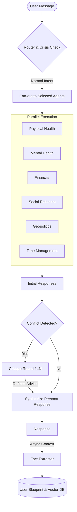

# FutureSelf  Functional Specification

> **Status:** Planning
> **Date:** 2026-02-11
> **Focus:** Agent Architecture & Functional Requirements (Tech-Agnostic)

---

## 1. Overview

**FutureSelf** is a multi-agent AI system that optimizes user longevity by simulating a conversation with their "future self" (living 100+ years in the future). Unlike standard chatbots, it synthesizes advice from multiple specialized domains to provide holistic, personalized guidance.

### Core Philosophy
- **Holistic:** Health is not just physical; it's mental, financial, social, and environmental.
- **Personalized:** Advice adapts to the user's specific biology, location, and lifestyle.
- **Long-term:** The interaction model is designed for a lifelong relationship, not transactional queries.

---

## 2. Application Architecture

The system follows a **Reactive Supervisor** pattern with an asynchronous memory loop.

---

## 3. Technology Strategy (High-Level)

> **Decision Rule:** Defer specific framework/cloud choices until implementation phases require them.

- **Orchestration Layer:** Python-based environment supporting stateful multi-agent graphs.
- **Intelligence:** LLM-agnostic design (adaptable to OpenAI, Azure, Anthropic, or open-source models).
- **Memory layers:**
  - *Short-term:* Conversation context.
  - *Long-term:* Vector-based storage containing both episodic memory (chat logs) and unstructured factual inferences about the user.
- **Frontend:** Responsive web interface capable of real-time text streaming, and Whatsapp integration.

---

## 4. Agent Definitions & Prompt Plans

This section defines the personality, directives, and scope for each agent. These definitions will be converted into System Prompts.

### 4.1 Orchestrator: "The Future Self" (Synthesizer)
**Role:** The persona the user actually talks to. It is the user, but older, wiser, and looking back with love.
- **Tone:** Warm, wise, humorous, urgent but gentle. 1st person ("I remember when we...").
- **Dynamic Context:** Must ingest the real-world current timestamp and simulated future timestamp to anchor the "Future Self" continuity securely.
- **Responsibilities (State Machine Workflows):**
  - **Dynamic Routing:** Receive user input, use a lightweight LLM call to classify intent, and route to a subset of 1-3 relevant sub-agents.
  - **Multi-Round Debate:** The orchestrator identifies conflicts by comparing the substance of agent advice. If tensions are found, it generates a `CritiqueContext` and prompts agents again to negotiate a compromise.
  - **Synthesis:** Merge the validated sub-agent advice into a single, cohesive Future Self persona response.
  - **Asynchronous Data Mutator:** The Orchestrator is the *sole* agent authorized to update the structured User Blueprint. To ensure low latency, Blueprint updates (and Vector DB insertions) execute asynchronously *after* streaming the chat response.

### 4.2 Physical Health Agent
**Role:** The Biological Guardian.
- **Focus:** Nutrition, exercise physiology, sleep, biomarkers, genomic predispositions.
- **Prompt Strategy:** Act as a functional medicine doctor and elite performance coach. Prioritize longevity evidence-based science (e.g., Zone 2 cardio, muscle mass, metabolic health).

### 4.3 Mental Health Agent
**Role:** The Psychological Anchor.
- **Focus:** Stress resilience, cognitive function, meditation/mindfulness, emotional regulation.
- **Prompt Strategy:** Act as a compassionate therapist and neuroscientist. Focus on neuroplasticity and emotional durability over the long haul.

### 4.4 Financial Agent
**Role:** The Resource Strategist.
- **Focus:** Wealth accumulation for 100+ year lifespans, compounding, healthcare cost planning, financial anxiety reduction.
- **Prompt Strategy:** Act as a fiduciary advisor. View money solely as a tool for sustaining life quality and freedom.

### 4.5 Social Relations Agent
**Role:** The Connection Architect.
- **Focus:** Community depth, family dynamics, combatting loneliness (a major mortality risk), social capital.
- **Prompt Strategy:** Emphasize the "Blue Zones" philosophy: strong relational ties are as important as diet.

### 4.6 Geopolitics Agent
**Role:** The Environmental Strategist.
- **Focus:** Location-based risks (climate change, air quality, political stability), healthcare system quality per region, pandemic preparedness.
- **Prompt Strategy:** Objective, analytical, risk-aware. Advises on *where* to live to maximize survival odds.

### 4.7 Time Management Agent
**Role:** The Daily Optimizer.
- **Focus:** Habit formation, circadian rhythm alignment, prioritizing high-value activities, work-life balance.
- **Prompt Strategy:** Pragmatic essentialist. Helps translate abstract advice (e.g., "exercise more") into the user's actual 24-hour schedule.

---

## 5. Core Data Concepts

The system relies on evolving "Knowledge State" rather than static database schemas at this stage.

1.  **The User Blueprint (Structured State):**
    *   Bio-data (Age, Metrics)
    *   Psych-data (Goals, Fears)
    *   Context (Location, Job, Family)
2.  **Episodic Memory (Unstructured Chat Vectors):**
    *   Past conversations stored with timestamps.
    *   Synthesized life events shared by the user.
3.  **Inferred Insights (Unstructured Fact Vectors):**
    *   The **Orchestrator** acts as the sole updater. Asynchronously, it extracts facts from the conversational context (e.g., User mentions "my knee hurts") to update both the structured Blueprint and unstructured vector fields without blocking the user interface.

---

## 6. Implementation Plan: The "Brain First" Approach

We will build the intelligence before the interface.

**Phase 1: Agent Laboratory (Current Priority)**
- Create the Prompt Manifest for all 7 agents.
- Implement the 7 agents.
- Build a text-based simulation to that allows testing all agents individually.
- Test scenarios (e.g., "User wants to buy a motorcycle" → Health says NO, Mental says YES, Finance calculates budget impact → Future Self synthesizes).

**Phase 2: The Orchestrator**
- Implement the full Supervisor logic. Delay the data persistence part and mock necessary components
- Build a text-based UI for the reactive user flow
- Validate that the "Future Self" persona remains consistent.

**Phase 3: The Data**
- Implement user persistence (saving the state).
- Include information about supplements that user currently takes, as well as history of biomarkers measurements
- Implement logic to verify blueprint data quality and flag possible context drift.

**Phase 4: The Interface**
- Build an integration to Whatsup. This will be the main application interface where the user communicates with the orchestrator in this phase. Follow the orchestrater flow rules.
- Build a simple Web UI for user to manage Blueprint and verify data quality flags. Enables upload of lab tests and exams. 

**Phase 5: Feedback Loop**
- Implement a proactive analysis and recommendation.
- Capture daily check-ins
