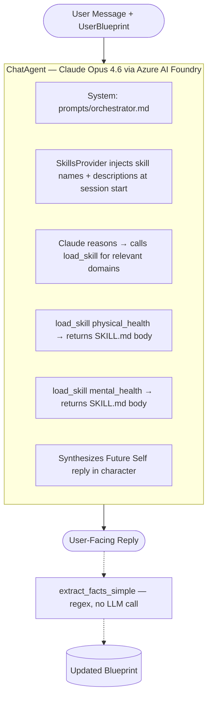

# FutureSelf Functional Specification

> Status: Active Implementation Spec
> Date: 2026-04-13
> Scope: Architecture and contracts after single-agent refactoring (Phases 1–5 complete)

---

## 1. Overview

**FutureSelf is a single-agent longevity guidance system.**
**The only user-facing component is the Future Self Synthesizer.**
Domain expertise is delivered via six skills loaded on demand — not via parallel sub-agents.

### Core goals
- **Holistic:** Health is not just physical; it's mental, financial, social, and environmental.
- **Personalized:** Advice adapts to the user's specific biology, location, and lifestyle.
- **Long-term:** The interaction model is designed for a lifelong relationship, not transactional queries.
- **Persona-consistent synthesis** as the user's future self.
- **Controlled blueprint updates** owned by orchestrator only.
- **Minimal LLM calls:** 1 Claude Opus 4.6 call per turn plus tool calls for skill loading (no extra completions).

---

## 2. Architecture Overview

Single-agent pipeline with MAF SkillsProvider for progressive domain disclosure.



**LLM calls per turn:** 1 completion + N `load_skill` tool calls (N = 0–3 relevant domains). Skill loading consumes no additional completions.

---

## 3. Skills

| # | Skill | Key | File |
|---|-------|-----|------|
| 1 | Physical Health | `physical_health` | `src/futureself/skills/physical_health/SKILL.md` |
| 2 | Mental Health | `mental_health` | `src/futureself/skills/mental_health/SKILL.md` |
| 3 | Financial | `financial` | `src/futureself/skills/financial/SKILL.md` |
| 4 | Social Relations | `social_relations` | `src/futureself/skills/social_relations/SKILL.md` |
| 5 | Geopolitics | `geopolitics` | `src/futureself/skills/geopolitics/SKILL.md` |
| 6 | Time Management | `time_management` | `src/futureself/skills/time_management/SKILL.md` |

### Domain Intent Snapshot

- **Physical Health:** Nutrition, exercise, sleep, biomarkers, and medical-risk-aware longevity advice.
- **Mental Health:** Stress resilience, emotional regulation, crisis signal awareness, and behavioral durability.
- **Financial:** Long-horizon planning, risk control, healthcare affordability, and stress-reducing simplicity.
- **Social Relations:** Loneliness risk reduction, relationship quality, and durable community integration.
- **Geopolitics:** Location risk analysis (air quality, climate, stability, healthcare system access).
- **Time Management:** Translating strategy into executable habits and schedules under real-life constraints.

---

## 4. Runtime Orchestration Flow

Single-turn flow (`run_turn`):

1. **Build** user context from `UserBlueprint` + `user_message` (conversation history, inferred facts, profile).
2. **Run** the MAF ChatAgent with `SkillsProvider` (Claude Opus 4.6 via Azure AI Foundry).
   - SkillsProvider injects skill names + descriptions at session start.
   - Claude reads the turn context, decides which skills are relevant, calls `load_skill` for each.
   - SkillsProvider returns the full SKILL.md body — no LLM call consumed.
   - Claude synthesizes the Future Self reply in character.
3. **Extract** new facts from the reply via `_extract_facts_simple` (regex, no LLM call).
4. **Append** turn to conversation history and merge new facts into blueprint (immutable copy).
5. **Return** `OrchestratorResult`.

Notes:
- Fact extraction is synchronous and regex-based — no additional LLM cost.
- `_agent` parameter in `run_turn` allows mock injection for tests without Azure credentials.

---

## 5. Data Contracts

All contracts live in `src/futureself/schemas.py`.

### 5.1 User Blueprint (`UserBlueprint`)

Frozen Pydantic model (`frozen=True`). Immutable for all callers; the orchestrator returns an updated copy via `model_copy`.

Top-level fields:
- `bio: BioData`
- `psych: PsychData`
- `context: ContextData`
- `conversation_history: list[ConversationTurn]`
- `inferred_facts: list[str]`

Class method:
- `from_dict(data: dict) -> UserBlueprint` — used by scenario test loader.

#### `BioData`

- `age: int | None`
- `sex: str | None`
- `height_cm: float | None`
- `weight_kg: float | None`
- `conditions: list[str]`
- `medications: list[str]`
- `supplements: list[Supplement]`
- `biomarker_history: list[BiomarkerEntry]`
- `exam_records: list[ExamRecord]`

Supporting types:
- **`Supplement`:** `name`, `dose`, `started`, `stopped`, `reason`
- **`BiomarkerEntry`:** `marker`, `value`, `unit`, `date`, `source`
- **`ExamRecord`:** `exam_type`, `date`, `provider`, `key_findings`, `raw_text`

#### `PsychData`

- `goals: list[str]`
- `fears: list[str]`
- `stress_level: str | None`
- `mental_health_flags: list[str]`

#### `ContextData`

- `location_city: str | None`
- `location_country: str | None`
- `occupation: str | None`
- `income_usd_annual: float | None`
- `family_situation: str | None`
- `lifestyle_notes: list[str]`

#### `ConversationTurn`

- `role: Literal["user", "assistant"]`
- `content: str`

### 5.2 LLM Call Trace (`LLMCallTrace`)

- `task: str` — e.g. `"orchestrator.run_turn"`
- `model_requested: str`
- `model_actual: str | None` — populated if provider reports actual model used
- `prompt_tokens: int`
- `completion_tokens: int`
- `latency_ms: float`

### 5.3 Turn Result (`OrchestratorResult`)

- `user_facing_reply: str`
- `updated_blueprint: UserBlueprint`
- `llm_traces: list[LLMCallTrace]`

---

## 6. MAF Skills and Agent Client

### SkillsProvider (Microsoft Agent Framework)

`SkillsProvider(skill_paths=Path("src/futureself/skills"))` discovers all `SKILL.md` files and:
1. Injects a `load_skill` tool definition into the agent's tool list.
2. At session start, appends a short skills manifest to the system prompt (~100 tokens/skill): name + description only.
3. Handles `load_skill("<name>")` tool calls by returning the full SKILL.md body.

Claude reads the manifest and autonomously decides which skills to load based on the user message.

### AzureAIAgentClient

```python
from agent_framework.azure import AzureAIAgentClient
from azure.identity.aio import DefaultAzureCredential

client = AzureAIAgentClient(
    project_endpoint=AZURE_FOUNDRY_ENDPOINT,
    model_deployment_name="claude-opus-4-6",
    credential=DefaultAzureCredential(),
)
agent = client.as_agent(
    name="FutureSelf",
    instructions=orchestrator_prompt,
    context_providers=[skills_provider],
)
```

### AnthropicFoundry (direct client, for non-hosted use)

```python
from anthropic import AnthropicFoundry
from azure.identity import DefaultAzureCredential, get_bearer_token_provider

token_provider = get_bearer_token_provider(DefaultAzureCredential(), "https://ai.azure.com/.default")
client = AnthropicFoundry(azure_ad_token_provider=token_provider, base_url=endpoint)
```

Authentication: Azure Entra ID via `DefaultAzureCredential` (managed identity in production, developer credentials locally).

---

## 7. Skill File Conventions

Each skill lives at `src/futureself/skills/<domain>/SKILL.md`:

```markdown
---
name: physical_health
description: >
  Analyze physical health, fitness, biomarkers, medications, and longevity protocols.
  Use when the user asks about exercise, sleep, nutrition, supplements, lab results,
  aging biomarkers, or any body-related longevity topic.
---

# Physical Health — "The Biological Guardian"
...domain system prompt content...
```

Skill prompt body structure: **Role → Domain Expertise → Prioritization Framework → Guidelines → Output Format**

`prompts/orchestrator.md` is not a skill — it is the agent's system prompt and is NOT processed by `SkillsProvider`.

---

## 8. Reliability and Fallback Rules

**No single malformed LLM response may crash a turn.**

| Failure | Fallback |
|---------|----------|
| Empty agent reply | Return `OrchestratorResult` with `user_facing_reply=""` |
| Fact extraction error | Return original blueprint unchanged |
| Missing `AZURE_FOUNDRY_ENDPOINT` | `_build_agent` raises at call time, not at import |

`agent_framework` imports are lazy (inside `_build_agent`) so the module loads in local dev without the cloud SDK installed.

---

## 9. Testing Requirements

### 9.1 Unit/Integration (mocked MAF agent)

Must cover:
- `run_turn` returns `OrchestratorResult` with correct fields.
- Blueprint immutability across turn.
- Conversation history appended with correct `ConversationTurn` objects.
- LLM trace recorded with correct task, model, and non-negative latency.
- `_extract_facts_simple`: age extraction, deduplication, empty reply.
- `_build_user_context`: includes user message, includes inferred facts.
- Empty model reply handled gracefully.

Mock pattern:
```python
def _mock_agent(reply: str) -> MagicMock:
    result = MagicMock()
    result.value = reply
    agent = MagicMock()
    agent.create_session = AsyncMock(return_value=MagicMock())
    agent.run = AsyncMock(return_value=result)
    return agent
```

### 9.2 Live Scenario Tests

- Marker-gated (`live`) and excluded by default (`addopts = "-m 'not live'"`).
- Scenario files in `scenarios/*.yaml`.
- Each scenario defines: `name`, `user_blueprint`, and `turns` with `user_message`.
- Multi-turn scenarios carry `updated_blueprint` forward between turns.
- Hard assertions: non-empty reply.

---

## 10. Implementation Roadmap

> **Decision Rule:** Build the intelligence before the interface.

**Phase 1: Agent Laboratory** — *Complete*

**Phase 2: The Orchestrator** — *Complete*

**Phase 3: The Initial Interface** — *Complete*

**Phase 4: Model Router and Cloud** — *Complete*

**Phase 5: Observability** — *Complete*

**Architecture Refactoring** — *Complete*
- Replaced 6-stage supervisor-worker pipeline (7–11 LLM calls/turn) with a single Claude Opus 4.6 agent.
- MAF `SkillsProvider` delivers progressive domain disclosure via `SKILL.md` files.
- `OrchestratorResult` simplified: removed `agents_consulted`, `initial_responses`, `refined_responses`, `conflict_detected`, `conflict_summary`, `AgentResponse`, `CritiqueContext`.
- Custom OpenTelemetry code removed; Foundry Application Insights used for observability.
- Deployment updated to Foundry Hosted Agent Service (`main.py` + `azure-ai-agentserver-agentframework`).
- LLM calls: 7–11 → 1 per turn.

**Phase 6: The Data** — *Active*
- User persistence (saving blueprint state across sessions).
- Supplement tracking and biomarker measurement history.
- Blueprint data quality verification and context drift flagging.
- Conversation history population.

**Phase 7: The Advanced Interface**
- WhatsApp integration as primary conversational interface.
- Web UI includes blueprint management, data quality flags, and lab test/exam uploads.

**Phase 8: Enhance Skills** *(Continuous)*
- Specialized tools to expand skill capabilities.
- Advice evaluation and quality feedback loops.

**Phase 9: Proactive Advice** *(Optional)*
- Proactive analysis and recommendations.
- Daily check-in capture.

---

## 11. Rebuild Checklist

A rebuild from scratch is valid only if all are true:

1. **`run_turn` implements the flow in Section 4.**
2. **All domain expertise is delivered via SKILL.md files following Section 7 conventions.**
3. **`_agent` parameter supports mock injection for tests.**
4. **Blueprint immutability is enforced: orchestrator uses `model_copy`, never mutates.**
5. **LLM call trace is recorded for every `run_turn` call.**
6. **Empty model replies do not crash a turn.**
7. **Tests from Section 9 are present and passing.**
