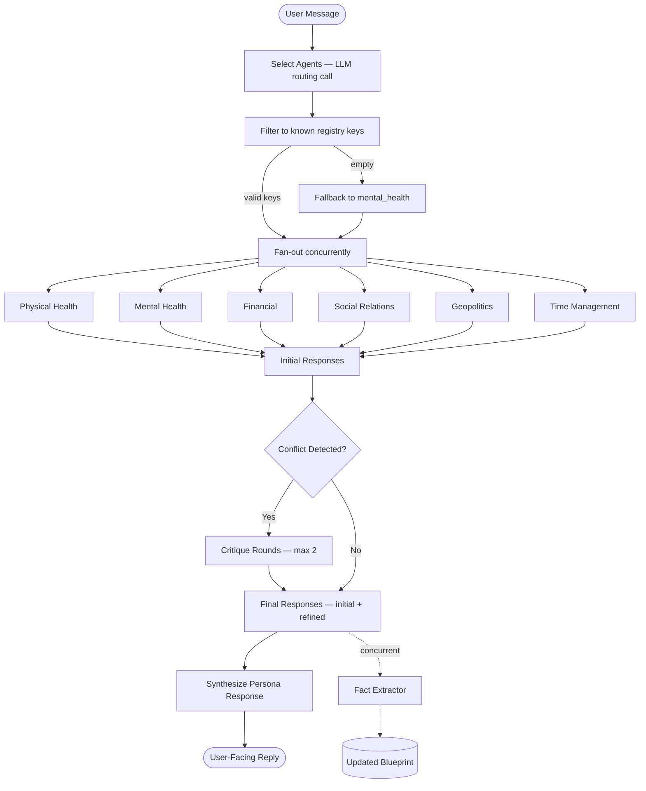

# FutureSelf Functional Specification

> Status: Active Implementation Spec
> Date: 2026-03-05
> Scope: Rebuild-ready architecture and contracts (Phase 1–3 complete)

---

## 1. Overview

**FutureSelf is a supervisor-worker multi-agent system for longevity guidance.**
**The only user-facing component is the Future Self Synthesizer (orchestrator).**
Worker agents are internal advisors.

### Core goals
- **Holistic:** Health is not just physical; it's mental, financial, social, and environmental.
- **Personalized:** Advice adapts to the user's specific biology, location, and lifestyle.
- **Long-term:** The interaction model is designed for a lifelong relationship, not transactional queries.
- **Persona-consistent synthesis** as the user's future self.
- **Controlled blueprint updates** owned by orchestrator only.
- **LLM-provider agnostic orchestration.**

---

## 2. Architecture Overview

The system follows a **Reactive Supervisor** pattern with an asynchronous memory loop.



---

## 3. Agent Set

| # | Agent | Registry key | Prompt file |
|---|-------|-------------|-------------|
| 1 | Future Self Synthesizer (orchestrator) | — | `prompts/orchestrator.md` |
| 2 | Physical Health | `physical_health` | `prompts/physical_health.md` |
| 3 | Mental Health | `mental_health` | `prompts/mental_health.md` |
| 4 | Financial | `financial` | `prompts/financial.md` |
| 5 | Social Relations | `social_relations` | `prompts/social_relations.md` |
| 6 | Geopolitics | `geopolitics` | `prompts/geopolitics.md` |
| 7 | Time Management | `time_management` | `prompts/time_management.md` |

### Agent Intent Snapshot

Purpose: keep core domain scope visible in the spec even if prompt files evolve.

- **Future Self Synthesizer:** Persona-consistent user-facing synthesis. Multi-domain routing, conflict handling, and final tradeoff decisions.
- **Physical Health:** Nutrition, exercise, sleep, biomarkers, and medical-risk-aware longevity advice.
- **Mental Health:** Stress resilience, emotional regulation, crisis signal awareness, and behavioral durability.
- **Financial:** Long-horizon planning, risk control, healthcare affordability, and stress-reducing simplicity.
- **Social Relations:** Loneliness risk reduction, relationship quality, and durable community integration.
- **Geopolitics:** Location risk analysis (air quality, climate, stability, healthcare system access).
- **Time Management:** Translating strategy into executable habits and schedules under real-life constraints.

---

## 4. Runtime Orchestration Flow

Single-turn flow (`run_turn`):

1. **Select** agents with a routing LLM call (targets 2–3 agents).
2. **Filter** to known `AGENT_REGISTRY` keys.
3. If empty after filtering, **fallback** to `["mental_health"]`.
4. **Fan-out** selected workers concurrently (`asyncio.gather`).
5. **Detect** conflicts from worker advice via LLM call.
6. If conflict exists, **run critique rounds** for implicated workers.
7. **Cap critique rounds** at `MAX_CRITIQUE_ROUNDS = 2`.
8. **Build** final response set (`initial + refined`).
9. **Start** fact extraction task (`asyncio.create_task`).
10. **Synthesize** user-facing Future Self reply.
11. **Await** fact extraction result and merge inferred facts.
12. **Return** `OrchestratorResult`.

Notes:
- **Fact extraction runs concurrently** with synthesis (latency optimization).
- **Current flow does not hard-stop on crisis signals as this solution is focused on longevity rather than crisis guidance.** 

---

## 5. Data Contracts

All contracts live in `src/futureself/schemas.py`.

### 5.1 Worker Base Contract (`AgentResponse`)

Required fields:
- `confidence: float` — normalized to `[0.0, 1.0]`
- `domain: str`
- `advice: str`
- `urgency: Literal["low", "medium", "high", "critical"]`

Internal fields:
- `is_refined: bool` — set by critique rounds, not by the model
- `extensions: dict[str, Any]` — captures all non-base JSON keys from model output

Normalization and fallback:
- Invalid/missing confidence → default `0.5`.
- Invalid/missing urgency → default `"low"`.
- Domain field is enforced by module domain key, not trusted from model payload.

Known domain extensions:
- `physical_health`: `contraindications`
- `social_relations`: `isolation_risk`
- `time_management`: `proposed_schedule_change`

### 5.2 Critique Context (`CritiqueContext`)

- `conflicting_advice: str`
- `concern_area: str`
- `orchestrator_question: str`
- `round_number: int`

### 5.3 User Blueprint (`UserBlueprint`)

Frozen Pydantic model (`frozen=True`). Immutable for workers; orchestrator returns an updated copy via `model_copy` when new facts are extracted.

Top-level fields:
- `bio: BioData`
- `psych: PsychData`
- `context: ContextData`
- `conversation_history: list[ConversationTurn]`
- `inferred_facts: list[str]`

Class method:
- `from_dict(data: dict) -> UserBlueprint` — used by scenario test loader.

#### `BioData`

- `age: int | None`
- `sex: str | None`
- `height_cm: float | None`
- `weight_kg: float | None`
- `conditions: list[str]`
- `medications: list[str]`
- `supplements: list[Supplement]`
- `biomarker_history: list[BiomarkerEntry]`
- `exam_records: list[ExamRecord]`

Supporting types:
- **`Supplement`:** `name`, `dose`, `started`, `stopped`, `reason`
- **`BiomarkerEntry`:** `marker`, `value`, `unit`, `date`, `source`
- **`ExamRecord`:** `exam_type`, `date`, `provider`, `key_findings`, `raw_text`

#### `PsychData`

- `goals: list[str]`
- `fears: list[str]`
- `stress_level: str | None`
- `mental_health_flags: list[str]`

#### `ContextData`

- `location_city: str | None`
- `location_country: str | None`
- `occupation: str | None`
- `income_usd_annual: float | None`
- `family_situation: str | None`
- `lifestyle_notes: list[str]`

#### `ConversationTurn`

- `role: Literal["user", "assistant"]`
- `content: str`

### 5.4 Turn Result (`OrchestratorResult`)

- `agents_consulted: list[str]`
- `initial_responses: dict[str, AgentResponse]`
- `refined_responses: dict[str, AgentResponse]`
- `conflict_detected: bool`
- `conflict_summary: str`
- `user_facing_reply: str`
- `updated_blueprint: UserBlueprint`

---

## 6. LLM Provider Abstraction

### Canonical interface

```
class LLMProvider(ABC):
    async complete(system: str, user: str, response_format: dict | None = None) -> str
    @classmethod get_default() -> LLMProvider
```

### Provider selection

Environment variables:
- `FUTURESELF_LLM_PROVIDER` — `openai` | `anthropic` (alias: `claude`) | `google` (alias: `gemini`)
- `FUTURESELF_LLM_MODEL` — overrides provider default model

| Provider | Env key for API key | Default model | Concurrency control |
|----------|-------------------|---------------|-------------------|
| OpenAI | `OPENAI_API_KEY` | `gpt-5-nano` | `OPENAI_MAX_CONCURRENT` (default 4) |
| Anthropic | `ANTHROPIC_API_KEY` | `claude-haiku-4-5-20251001` | — |
| Google Gemini | `GOOGLE_API_KEY` / `GEMINI_API_KEY` | `gemini-2.0-flash` | `GEMINI_RPM` (default 15) |

### Provider hardening requirements

- Env-based numeric limits must be parsed safely with sane defaults (invalid/zero → fallback).
- Empty vendor responses must not crash the pipeline (return `""`).
- Anthropic: `response_format={"type": "json_object"}` is handled by appending a JSON-only instruction to the user content (no native param).
- Google: `response_format={"type": "json_object"}` maps to `response_mime_type = "application/json"`. Includes retry logic (3 attempts, backoff on HTTP 429).

---

## 7. Worker Module Conventions

Worker modules are thin wrappers:
```python
from futureself.agents._base import make_run
run = make_run("<domain>")
```

Shared logic in `_base.py`:
- `make_run(domain)` — factory returning an `async run()` coroutine. Resolves prompt from `prompts/{domain}.md`.
- `build_user_context(blueprint, user_message, critique_context)` — assembles user turn text including optional critique block.
- `parse_response(raw, domain, is_refined)` — best-effort JSON parse, normalization, extension capture.

---

## 8. Prompt Structure Conventions

Worker prompt structure:
- Role
- Domain Expertise
- Prioritization Framework
- Guidelines
- Output Format

Orchestrator prompt structure:
- Identity
- Tone
- Responsibilities
- Conflict Resolution
- Response Format

All worker prompts include an explicit coordination line naming agents to coordinate with.

---

## 9. Reliability and Fallback Rules

**All JSON parsing from model output must be best-effort and non-fatal.**

| Parse failure | Fallback |
|--------------|----------|
| Agent selection | `[]` (then orchestrator fallback to `["mental_health"]`) |
| Conflict detection | No conflict (`False, "", []`) |
| Fact extraction | No blueprint change (return original) |
| Worker response | Safe default `AgentResponse` (`confidence=0.5`, `advice=""`, `urgency="low"`) |

**No single malformed LLM response may crash a turn.**

---

## 10. Testing Requirements

### 10.1 Unit/Integration (mocked LLM)

Must cover:
- Valid routing, unknown agent filtering, empty fallback.
- Parallel fan-out behavior.
- Conflict/no-conflict paths.
- Critique loop capped to configured max rounds.
- Blueprint immutability across turn.
- Fact extraction merge + dedupe behavior.
- Malformed JSON fallback in selection, conflict, facts, and worker parsing.
- Provider edge cases (invalid env numeric settings, empty provider payloads).
- Agent contract compliance across all 6 domains (parametrized).
- Extension field capture per domain.

### 10.2 Live Scenario Tests

- Marker-gated (`live`) and excluded by default (`addopts = "-m 'not live'"`).
- Scenario files in `scenarios/*.yaml`.
- Each scenario defines: `name`, `blueprint` (bio/psych/context), and one or more `turns` with `user_message`, `expect_agents`, `expect_conflict`.
- Multi-turn scenarios carry `updated_blueprint` forward between turns.
- Hard assertions: non-empty reply, at least 1 agent consulted.
- Soft assertions (logged, not fatal): expected agents vs actual, expected conflict vs actual.

---

## 11. Implementation Roadmap

> **Decision Rule:** Build the intelligence before the interface.

**Phase 1: Agent Laboratory** — *Complete*
- Prompt manifest for all 7 agents.
- Worker agent implementations.
- Text-based simulation for individual agent testing.
- Scenario-driven validation (e.g., motorcycle purchase → Health vs Mental vs Finance conflict).

**Phase 2: The Orchestrator** — *Complete*
- Full supervisor flow (`run_turn`): routing, fan-out, conflict detection, critique loop, synthesis.
- Provider abstraction with three concrete backends (OpenAI, Anthropic, Google).
- Fact extraction into inferred facts.
- Mock-driven and live-capable test suites.

**Phase 3: The Initial Interface**
- Basic Web UI for standard user flow.
- First-time user set up flow to capture basic blueprint.

**Phase 4: Model router and cloud**
- Model router logic to optimize the performance and cost of LLM calls according to the task complexity or knowledge domain performance. 
- Each agent may have their own optimum model choice
- Deploy and run application and agents on the cloud 

**Phase 5: The Data**
- User persistence (saving blueprint state across sessions).
- Supplement tracking and biomarker measurement history.
- Blueprint data quality verification and context drift flagging.
- Conversation history population.

**Phase 6: The Advanced Interface**
- WhatsApp integration as primary conversational interface.
- Web UI includes blueprint management, data quality flags, and lab test/exam uploads.
- Both UIs has a first-time user set up to capture basic blueprint.

**Phase 7: Enhance Agents** *(Continuous)*
- Specialized tools to expand agent capabilities.
- Advice evaluation and quality feedback loops.

**Phase 8: Proactive Advice** *(Optional)*
- Proactive analysis and recommendations.
- Daily check-in capture.

---

## 12. Rebuild Checklist

A rebuild from scratch is valid only if all are true:

1. **`run_turn` implements the flow in Section 4.**
2. **All worker outputs satisfy the base contract in Section 5.1.**
3. **All LLM calls use `LLMProvider` interface from Section 6.**
4. **Worker modules use `make_run(domain)` pattern from Section 7.**
5. **Prompts follow structure conventions from Section 8.**
6. **JSON parse resilience follows Section 9.**
7. **Tests from Section 10 are present and passing.**
